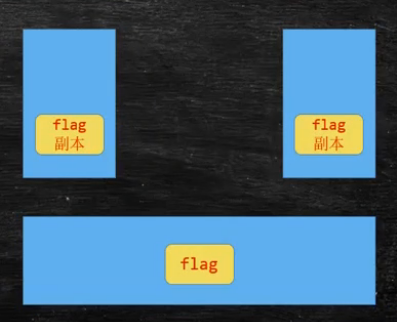

# 																																																																																																																					Concurrent

## Part 01  基础概念

> 进程与线程的区别：
>
> QQ.exe是一个进程
>
> **线程是进程中的一个最小执行单元**

### 创建线程的方式

- extends Thread
- implements Runnable
- Thread Pool

>  Callable - 一般配合线程池来使用

### 线程的常用方法

- `static void sleep(long millionSeconds) ;`
- `static void yield(); `    进入等待队列
- `void join();`    将另一个线程加入到当前线程，常用于等待另一个线程的结束

> Attention
>
> - notify 	不释放锁
> - wait        释放锁

### 线程状态


```java
/**
 * Thread States:
 *      1. NEW - Not Start
 *      2. RUNNABLE
 *            Ready
 *            Running
 *      3. BLOCKED          Waiting Execute Synchronized Code
 *      4. WAITING          wait(), join(), park()
 *      5. TIMED_WAITING    Waiting With Timed Out
 *      6. Terminated       Completed
 */
```

### synchronized

- 为某个**对象**加锁，互斥锁

- synchronized用在方法上，下面两种写法等同

  ```java
  public synchronized void test() {
  	// ...
  }
  public void test() {
  	synchronized (this) {
  		// synchronized(this) - 锁定当前对象
          // ...
  	}
  }
  ```

- hotspot实现：在对象头的64位中拿出两位，代表对象是否被锁定，以及锁的类型。

- synchronized 修饰静态方法：锁定class对象

- 一个synchronized代码块相当于一个原子操作

- 同步方法执行过程中，非同步方法依然可以执行

- 对业务写方法加锁，读方法不加锁，会产生“脏读”(dirty read)问题

  ​	copy on write

- 一个同步方法可以调用另一个同步方法，一个线程已经拥有某个对象的锁，再次申请的时候仍然会得到该对象的锁。

  也就是说，synchronized获得的锁是可重入的

  - 子类调用父类的同步方法也是同样可以的
  - 如果不可重入，子类重写方法：`super.m(); `会死锁

- 程序在执行过程中，如果出现异常，默认情况锁会被释放。所以在并发处理的过程中，有异常要多加小心，不然可能会发生不一致的情况。

  比如：在一个web app处理过程中，多个servlet线程共同访问同一个资源，这时如果异常处理不合适，在第一个线程中抛出异常，其他线程就会进入同步代码中，有可能会访问到异常产时的数据。因此，要非常小心地处理同步业务逻辑中的异常

- synchronized不能锁定String常量(常量池)，Integer，Long(Integer和Long内部的特殊处理。数值修改时会产生新对象)

- synchronized的优化

  同步代码块中的语句越少越好。采用细粒度的锁，可以使线程征用时间变短，提高效率

- 锁定某对象o，如果o的属性发生改变，不影响锁的使用。但是如果o变成另一个对象，则锁定的对象发生改变，应避免将锁定的对象引用变成另外的对象(final)

synchronized的底层实现

- jdk早期  重量级 -> 向OS申请

- 改进：锁升级的概念(hotspot)

  - synchronized(Object) 对象头(markword)记录这个线程id（偏向锁）
- 如果有线程争用，升级为自旋锁（默认旋10次）(while(true)，占用CPU，但不访问操作系统)
  - 自旋10次以后，升级为重量级锁  ->  OS
- 加锁代码：执行时间短，线程数少，用自旋锁
  		                                   执行时间长，线程数多，用系统锁

> 自旋锁占用CPU，synchronized在等待队列里，不占用CPU时间

### volatile

- **保证线程可见性**

  使一个变量在多个线程间可见

  A，B线程都用到一个变量，java默认是A线程中保留一份copy，这样如果B线程修改了该变量，A线程未必知道。使用volatile关键字，会让所有线程都读到变量的修改值

  **volatile并不能保证多个线程共同修改变量所带来的不一致问题，也就是说，volatile不能替代synchronized**

  本质上是使用了MESI，即CPU的缓存一致性协议

  

- **禁止指令重排序**

  - DCL单例
  

#### new对象的步骤

1. 申请内存
2. 给成员变量赋值
3. 将这块内存赋值给变量

- **Singleton Double Check Lock不加volatile可能会出现的问题**

  b，c有可能发生指令重排序，在超高并发量时，new Instance的a, c步骤已经执行，b未执行，此时另一个线程判断INSTANCE != null，将会直接使用这个对象，但是此时对象的成员变量为空，可能会出现异常。

### CAS（无锁优化、自旋）

#### AtomicInteger - CAS操作

`incrementAndGet();				->  		线程安全的count++`

#### CAS

- Compare And Set / Swap

```java
  cas(V, Expected, NewValue) {
  // V 要改的   Expected    期望的原来的值    New    新值
  	if V == E
  		V = New
  	otherwise
  		try again or fail
  }
```

- CPU原语支持
- 就是乐观锁

#### ABA问题

​		如果基础类型，不会有问题

​		引用类型会有问题：加version

### Sync  vs  Atomic  vs  LongAdder

高并发情况下的效率：LongAdder > Atomic > Synchronized

Atomic  -> 不加锁（乐观锁，cas）   >  Synchronized

LongAdder  ->  分段锁   cas  >   Atomic    低并发没有优势


## Part 02  JUC同步工具

### 常用的其他锁

#### ReentrantLock

- CAS锁

- 使用ReentrantLock可以完成和synchronized同样的功能，但需要注意的是，**必须要手动释放锁**
- 使用synchronized关键字时，遇到异常，jvm会自动释放锁，但ReentrantLock必须手动释放，因此经常在finally中进行锁的释放。
- 使用ReentrantLock可以进行“尝试锁定”，这样无法锁定或在执行时间内无法锁定时，线程可以执行不同的逻辑
- 使用ReentrantLock可以调用lockInteruptibly方法，可以对线程interupt方法做出响应。在一个线程等待锁的过程中，可以被打断。
- synchronized默认为不公平锁，Reentrantlock可以指定为公平锁，即谁处于等待队列的队头，谁得到锁

#### CountDownLatch

- 门闩
- 阻塞
- 构造方法：`new CountDownLatch(int count);`
- `await()`  阻塞
- `latch.countDown()`  令count减1，直到count为0，阻塞放开

#### CyclicBarrier

- 栅栏
- 阻塞
- 构造方法：`new CyclicBarrier(int count, Runnable runnable)`
- `barrier.await()`阻塞方法，直到等待的线程数到达count值，栅栏倒下，执行runnable，同时各个线程继续执行

#### Phaser

- 不同的阶段
- onAdvance()   每个栅栏推倒时自动调用
- arriveAndWaitAdvance()
- arriveAndDeregister()

#### ReadWriteLock

- 读写锁
- 共享锁、排他锁
- 写锁排他，读锁共享
- 用于读多写少的场景，读线程访问时，上读锁，其他读线程可以访问，写线程不能访问。写线程访问时，其他写线程和读线程都不能访问

#### Semaphore

- 信号灯
- s.acquire()     获取   若获取不到，阻塞
- s.release()     释放
- 限流
- 默认不公平，构造方法传true是公平锁

#### Exchanger

- 线程之间交换数据
- exchanger.exchange(s)              // 阻塞方法
- 只能用于两个线程之间


#### LockSupport

- LockSupport.park()	当前线程阻塞
- LockSupport.unPark()     
- unpark()可以先于park()调用

### 几个多线程问题

#### Question 01

实现一个容器，提供两个方法，add，size。写两个线程，线程 1 添加 10 个元素到容器中，线程 2 实现监控元素的个数，当个数到 5 个时，线程 2 给出提示并结束

- volatile不可用
- wait() notify()      - notify不释放锁，wait释放锁
- LockSupport

#### <font color="red">※ Question 02</font>

写一个固定容量的同步容器，拥有 put 和 get 方法，以及 getCount 方法，能够支持 2 个生产者线程以及 10 个消费者线程的阻塞调用

- 生产者消费者问题
- while
- wait()   notifyAll()
- Condition
- BlockingQueue(最适合实现生产者消费者的数据结构)

### Condition

- await(),  signalAll()
- 实质上是一个新的等待队列
- 用consumer条件await的进入consumer等待队列；用producer条件signal唤醒producer队列的线程

### AQS

- AbstractQueuedSynchronizer


#### 模板方法 / 钩子函数

父类定义方法，并调用，子类实现方法，最终调用的实际上是子类的方法

#### VarHandle

- since  jdk1.9
- 底层  native  实现，比反射快，直接操纵二进制码
- 普通属性也可以进行原子性操作

### ThreadLocal

- 线程独有，一个线程操作，另一个线程拿不到
- 应用：Spring声明式事务，保证同一个Connection

#### 源码

- set
  - Thread.currentThread.map(ThreadLocal, person)
  - 设到了当前线程的map

### Java的四种引用 - 强软弱虚

#### 强引用

- 普通类型就是强引用
- Object o = new Object()
- 只要有一个引用指向这个对象，那么一定不会被垃圾回收器回收

#### 软引用

- 只有系统内存不够用的时候，才会回收它

#### 弱引用

- 只要遇到垃圾回收，就会被回收
- 一般用在容器里
- 一个对象，A通过强引用指向，B通过弱引用指向，若A不再指向该对象，经历过GC后，B也将为空
- 典型应用：ThreadLocal 


##### 内存泄漏和内存溢出

- 内存泄漏：存在一块内存，永远不会被回收
- 内存溢出：内存不够用

#### 虚引用

- PhantomReference<M> m = new PhantomReference(new M(), QUEUE)
- 遇到垃圾回收，就会被回收
- 被回收时，对象会被放进队列里（即发送通知）
- 虚拟机管理堆外内存使用。监测QUEUE，收到通知时回收堆外内存。

## Part 03  同步容器


### 容器总览


#### 发展过程

- Vector和HashTable是最初代的容器，二者中所有的方法都是加锁的，基本不用。
- HashMap中所有的方法均不加锁
- Collections.synchronizedMap(new HashMap<>())
- ConcurrentHashMap
- ConcurrentHashMap的主要优势主要集中在读上，写入没有优势(synchronized比较快)

#### Queue和List的区别

Queue添加了很多对线程友好的API

- offer()
- poll()
- peek()
- put()     (BlockingQueue特有)
- take()   (BlockingQueue特有)

### 常用的高并发容器

<hr>

#### ConcurrentHashMap

- 查找效率高，插入效率低

#### ConcurrentSkipListMap

- 高并发并且排序
- 跳表实现

##### 跳表


查询时从上往下查找，缩小查询范围

#### CopyOnWriteList

- 写时复制
- 读时不加锁，写时加锁。
- 写的时候copy一份，加一格，放入新元素引用指向新List

#### ConcurrentQueue

- offer(E e)   添加，是否成功用返回值判断，添加不成功不会抛异常
- peek           take but not remove
- poll             take and remove

#### BlockingQueue

- put(E e);                      如果满了，就会等待（阻塞）
- E take();                       空了会阻塞
- 最适合实现生产者消费者的容器
- 源码：Condition . await()

##### LinkedBlockingQueue

- 无界

##### ArrayBlockingQueue

- 有界

##### DelayQueue

- BlockingQueue的一种
- 时间上的排序
- 里面存储的元素必须实现Delayed接口并重写compareTo方法
- 元素取出的顺序会按照compareTo的结果取出
- 常用于按时间进行任务调度
- 本质上是一个优先队列(PriorityQueue)

##### SynchronusQueue

- 容量为0
- put()会阻塞，等待消费者消费
- 用于一个线程给线程传递任务

##### TransferQueue

- transfer(E e)
- 不满也阻塞，只要transfer()了就会阻塞

### 面试题


两个线程交替输出：A1B2C3....Z26

- **wait()  notify()  notifyAll()**
- **LockSupport    park()  unpark**
- **lock condition**
- enumeration
- BlockingQueue
- PipedStream   线程间通信

## Part04  线程池


### 几个基础接口

#### Callable

- Similar to Runnable but with a return value

#### Future

- T get();            阻塞方法，拿到后继续执行，没拿到，等待

#### Executor

- execute(@NotNull Runnable runnable)

#### ExecutorService

- extends Executor
- Future<T>  submit(Callable<T>)

#### FutureTask

- implements RunnableFuture<V>
- 既是一个Future，也是一个Task。即运行完的结果存在自己本身

#### CompletableFuture

- 对各种任务的管理类
- 管理多个Future
- 链式的处理方式
- `static supplyAsync(Supplier<U> supplier)`    执行一个异步任务
- `allOf(CompletableFuture... cfs).join() `    所有任务执行完再继续执行
- `anyOf(CompletableFuture... cfs).join()`    一个任务执行完就往下执行

### 线程池


#### ThreadPoolExecutor

- extends AbstractExecutorService
- 维护着两个队列：线程队列 + 任务队列


##### 执行步骤

- 来了新任务后，先交给核心线程执行
- 如果核心线程都在工作状态，则放入任务队列中
- 若任务队列已满，则开启新的非核心线程
- 若非核心线程已到最大值，则执行拒绝策略(reject)

##### Executors

线程池的工厂

##### 构造函数七个参数

- corePoolSize：核心线程数

- maximumPoolSize：最大线程数

- keepAliveTime：生存时间

  线程多长时间不工作，会归还给操作系统。但核心线程不再归还（可以通过参数指定是否归还）

- TimeUnit：时间单位

- BlockingQueue：任务队列

  用不同的Queue存储的时候会产生不同的线程池

  - ArrayBlockingQueue     固定长度的阻塞队列
  - LinkedBlockingQueue   最大长度是Integer.MAX_VALUE
  - SynchronousQueue    任务到达必须处理，不然其他任务加不进来
  - TransferQueue    来的任务必须等着，需要等线程池处理完才能走

- ThreadFactory：线程工厂

  传入的参数必须implements ThreadFactory

  Executors.defaultThreadFactory() / new CustomizableThreadFactory(".")

- RejectedExecutionHandler：拒绝策略

  线程池忙，且任务队列满时，执行拒绝策略

  拒绝策略线程池默认提供四种

  - AbortPolicy：抛异常
  - DiscardPolicy：默默丢弃
  - DiscardOldestPolicy：丢弃任务队列中已等待时间最长的任务
  - CallerRunsPolicy：交付线程自己执行

  一般时候，我们会执行自定义策略，一般会保存到Kafka, Redis,Database

##### 几种不同的线程池

###### SingleThreadPool

- 线程池里只有一个线程
- 可以保证任务顺序执行
- 任务队列：LinkedBlockingQueue

> Question：为什么要有单线程的线程池？
>
> 1. 任务队列
> 2. 完整的生命周期管理

###### CachedThreadPool

- 没有核心线程，最大线程数为Integer.MAX_VALUE
- 任务队列使用SynchronousQueue
- 来了新任务马上处理，没有空闲线程就新建线程
- 缺点：线程数会非常多

###### FixedThreadPool

- 线程数固定（核心线程数 = 最大线程数）
- 底层LinkedBlockingQueue

###### ScheduledThreadPool

- 执行定时任务
- 底层DelayedWorkQueue
- 好处：可以执行并行的计算

> 面试题：假如提供一个闹钟服务，每天早上七点钟闹钟响，订阅这个服务的人特别多，10亿，意味着每天早上七点，服务器要涌进10亿的并发量，如何去优化？
> 1. 分发给多个服务器去执行
> 2. 存到一个任务队列中，多个线程去消费

##### ThreadPoolExecutor源码

###### 线程池的状态

- **RUNNING**:  Accept new tasks and process queued tasks
- **SHUTDOWN**: Don't accept new tasks, but process queued tasks
- **STOP**:  Don't accept new tasks, don't process queued tasks,
         and interrupt in-progress tasks
- **TIDYING**:  All tasks have terminated, workerCount is zero,
         the thread transitioning to state TIDYING
         will run the terminated() hook method
- **TERMINATED**: terminated() has completed

###### Worker类

- extends AbstractQueuedSynchronizer implements Runnable
- 本身既是一个任务，又是一把锁

###### addWorker(Runnable, boolean)

- count++
- start

详细内容参考文档：[ThreadPoolExecutor Source Code.md](ThreadPoolExecutor Source Code.md) 

#### ForkJoinPool

##### ForkJoinPool

- 分解汇总的任务
- 用很少的线程可以执行很多的任务（子任务），TPE做不到先执行子任务
- CPU密集型
- **每个线程都维护自己的一个任务队列**（与ThreadPoolExecutor的区别）
- 执行的任务必须继承ForkJoinTask（一般不继承此类，一般继承下面两个抽象类）
  - RecursiveAction extends ForkJoinTask<Void>
  - RecursiveTask<T> extends ForkJoinTask<T>


##### WorkStealingPool

- 一个特殊的ForkJoinPool
- 每个线程自己的任务执行完后，会去别的线程的任务队列上窃取任务执行


- WorkStealingPool产生的是精灵线程（守护线程，后台线程，Daemon Thread）	，主线程结束后，精灵线程在后台运行，看不到输出。需要主线程阻塞才可以看到输出

##### parallelStream

- 流式API的一种
- 并行流
- 实际上用的也是ForkJoinPool

## Part05  JMH与Disruptor


### JMH

- Java准测试工具套件
- 官网： http://openjdk.java.net/projects/code-tools/jmh/ 

#### 创建JMH测试

1. 创建Maven项目，添加依赖

   ```xml
           <dependency>
               <groupId>org.openjdk.jmh</groupId>
               <artifactId>jmh-core</artifactId>
               <version>1.21</version>
           </dependency>
   
           <dependency>
               <groupId>org.openjdk.jmh</groupId>
               <artifactId>jmh-generator-annprocess</artifactId>
               <version>1.21</version>
               <scope>test</scope>
           </dependency>
   ```

2. idea安装JMH插件 JMH plugin v1.0.3

3. 由于用到了注解，打开运行程序注解配置

   > compiler -> Annotation Processors -> Enable Annotation Processing

4. 定义需要测试类PS (ParallelStream)

   ```java
   import java.util.ArrayList;
   import java.util.List;
   import java.util.Random;
   
   public class PS {
   
   	static List<Integer> nums = new ArrayList<>();
   	static {
   		Random r = new Random();
   		for (int i = 0; i < 10000; i++) nums.add(1000000 + r.nextInt(1000000));
   	}
   
   	static void foreach() {
   		nums.forEach(v->isPrime(v));
   	}
   
   	static void parallel() {
   		nums.parallelStream().forEach(PS::isPrime);
   	}
   	
   	static boolean isPrime(int num) {
   		for(int i=2; i<=num/2; i++) {
   			if(num % i == 0) return false;
   		}
   		return true;
   	}
   }
   ```

5. 写单元测试

   > 这个测试类一定要在test package下面
   >
   > ```java
   > package com.mashibing.jmh;
   > 
   > import org.openjdk.jmh.annotations.Benchmark;
   > 
   > import static org.junit.jupiter.api.Assertions.*;
   > 
   > public class PSTest {
   >  @Benchmark
   >  public void testForEach() {
   >      PS.foreach();
   >  }
   > }
   > ```

6. 运行测试类，如果遇到下面的错误：

   ```java
   ERROR: org.openjdk.jmh.runner.RunnerException: ERROR: Exception while trying to acquire the JMH lock (C:\WINDOWS\/jmh.lock): C:\WINDOWS\jmh.lock (拒绝访问。), exiting. Use -Djmh.ignoreLock=true to forcefully continue.
   	at org.openjdk.jmh.runner.Runner.run(Runner.java:216)
   	at org.openjdk.jmh.Main.main(Main.java:71)
   ```

   这个错误是因为JMH运行需要访问系统的TMP目录，解决办法是：

   打开RunConfiguration -> Environment Variables -> include system environment viables

7. 阅读测试报告

#### JMH中的基本概念

1. Warmup
   预热，由于JVM中对于特定代码会存在优化（本地化），预热对于测试结果很重要
2. Mesurement
   总共执行多少次测试
3. Timeout

4. Threads
   线程数，由fork指定
5. Benchmark mode
   基准测试的模式
6. Benchmark
   测试哪一段代码

> 官方样例：
> http://hg.openjdk.java.net/code-tools/jmh/file/tip/jmh-samples/src/main/java/org/openjdk/jmh/samples/

### Disruptor

#### 介绍

- 内存里用于高效存储的队列
- 速度最快的MQ
- 性能极高，无锁cas，单机支持高并发
- 主页：http://lmax-exchange.github.io/disruptor/
- 源码：https://github.com/LMAX-Exchange/disruptor
- GettingStarted: https://github.com/LMAX-Exchange/disruptor/wiki/Getting-Started
- api: http://lmax-exchange.github.io/disruptor/docs/index.html
- maven: https://mvnrepository.com/artifact/com.lmax/disruptor

#### Disruptor的特点

- 对比ConcurrentLinkedQueue : 链表实现
- JDK中没有ConcurrentArrayQueue
- Disruptor是数组实现的
- 核心：环形队列
- 无锁，高并发，使用环形Buffer，直接覆盖（不用清除）旧的数据，降低GC频率
- 实现了基于事件的生产者消费者模式（观察者模式）

#### RingBuffer

- 环形队列
- RingBuffer的序号，指向下一个可用的元素
- 采用数组实现，没有首尾指针
- 对比ConcurrentLinkedQueue，用数组实现的速度更快

> 假如长度为8，当添加到第12个元素的时候在哪个序号上呢？用12%8决定
>
> 当Buffer被填满的时候到底是覆盖还是等待，由Producer决定
>
> 长度设为2的n次幂，利于二进制计算，例如：12%8 = 12 & (8 - 1)  pos = num & (size -1)

#### Disruptor开发步骤

1. 定义Event - 队列中需要处理的元素

2. 定义Event工厂，用于填充队列

   > 这里牵扯到效率问题：disruptor初始化的时候，会调用 Event 工厂，对 RingBuffer 进行内存的提前分配
   >
   > GC产频率会降低

3. 定义EventHandler（消费者），处理容器中的元素

##### 事件发布模板

```java
long sequence = ringBuffer.next();  //Grab the next sequence
try {
    LongEvent event = ringBuffer.get(sequence); // Get the entry in the Disruptor
    // for the sequence
    event.set(8888L);  // Fill with data
} finally {
    ringBuffer.publish(sequence);
}
```

##### 使用EventTranslator发布事件

```java
//==========================================================
        EventTranslator<LongEvent> translator1 = new EventTranslator<LongEvent>() {
            @Override
            public void translateTo(LongEvent event, long sequence) {
                event.set(8888L);
            }
        };

        ringBuffer.publishEvent(translator1);

        //=========================================================
        EventTranslatorOneArg<LongEvent, Long> translator2 = new EventTranslatorOneArg<LongEvent, Long>() {
            @Override
            public void translateTo(LongEvent event, long sequence, Long l) {
                event.set(l);
            }
        };

        ringBuffer.publishEvent(translator2, 7777L);

        //=========================================================
        EventTranslatorTwoArg<LongEvent, Long, Long> translator3 = new EventTranslatorTwoArg<LongEvent, Long, Long>() {
            @Override
            public void translateTo(LongEvent event, long sequence, Long l1, Long l2) {
                event.set(l1 + l2);
            }
        };

        ringBuffer.publishEvent(translator3, 10000L, 10000L);

        //=========================================================
        EventTranslatorThreeArg<LongEvent, Long, Long, Long> translator4 = new EventTranslatorThreeArg<LongEvent, Long, Long, Long>() {
            @Override
            public void translateTo(LongEvent event, long sequence, Long l1, Long l2, Long l3) {
                event.set(l1 + l2 + l3);
            }
        };

        ringBuffer.publishEvent(translator4, 10000L, 10000L, 1000L);

        //=========================================================
        EventTranslatorVararg<LongEvent> translator5 = new EventTranslatorVararg<LongEvent>() {

            @Override
            public void translateTo(LongEvent event, long sequence, Object... objects) {
                long result = 0;
                for(Object o : objects) {
                    long l = (Long)o;
                    result += l;
                }
                event.set(result);
            }
        };

        ringBuffer.publishEvent(translator5, 10000L, 10000L, 10000L, 10000L);
```

##### 使用Lamda表达式

```java
package com.mashibing.disruptor;

import com.lmax.disruptor.RingBuffer;
import com.lmax.disruptor.dsl.Disruptor;
import com.lmax.disruptor.util.DaemonThreadFactory;

public class Main03
{
    public static void main(String[] args) throws Exception
    {
        // Specify the size of the ring buffer, must be power of 2.
        int bufferSize = 1024;

        // Construct the Disruptor
        Disruptor<LongEvent> disruptor = new Disruptor<>(LongEvent::new, bufferSize, DaemonThreadFactory.INSTANCE);

        // Connect the handler
        disruptor.handleEventsWith((event, sequence, endOfBatch) -> System.out.println("Event: " + event));

        // Start the Disruptor, starts all threads running
        disruptor.start();

        // Get the ring buffer from the Disruptor to be used for publishing.
        RingBuffer<LongEvent> ringBuffer = disruptor.getRingBuffer();


        ringBuffer.publishEvent((event, sequence) -> event.set(10000L));

        System.in.read();
    }
}
```

#### ProducerType生产者线程模式

ProducerType有两种模式 Producer.MULTI和Producer.SINGLE，默认是MULTI，表示在多线程模式下产生sequence。如果确认是单线程生产者，那么可以指定SINGLE，效率会提升

> Question：如果是多个生产者（多线程），但模式指定为SINGLE，会出什么问题呢？
>
> SINGLE没有锁，会有并发问题，有一部分Event会被覆盖掉

#### 等待策略

1. (常用）BlockingWaitStrategy：通过线程阻塞的方式，等待生产者唤醒，被唤醒后，再循环检查依赖的sequence是否已经消费。
2. BusySpinWaitStrategy：线程一直自旋等待，可能比较耗cpu
3. LiteBlockingWaitStrategy：线程阻塞等待生产者唤醒，与BlockingWaitStrategy相比，区别在signalNeeded.getAndSet,如果两个线程同时访问一个访问waitfor,一个访问signalAll时，可以减少lock加锁次数
4. LiteTimeoutBlockingWaitStrategy：与LiteBlockingWaitStrategy相比，设置了阻塞时间，超过时间后抛异常。
5. PhasedBackoffWaitStrategy：根据时间参数和传入的等待策略来决定使用哪种等待策略
6. TimeoutBlockingWaitStrategy：相对于BlockingWaitStrategy来说，设置了等待时间，超过后抛异常
7. （常用）YieldingWaitStrategy：尝试100次，然后Thread.yield()让出cpu
8. （常用）SleepingWaitStrategy：sleep

#### 消费者异常处理

- 默认：disruptor.setDefaultExceptionHandler()
- 覆盖：disruptor.handleExceptionFor().with()