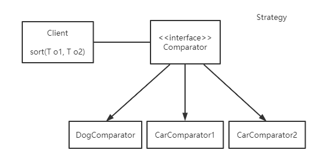
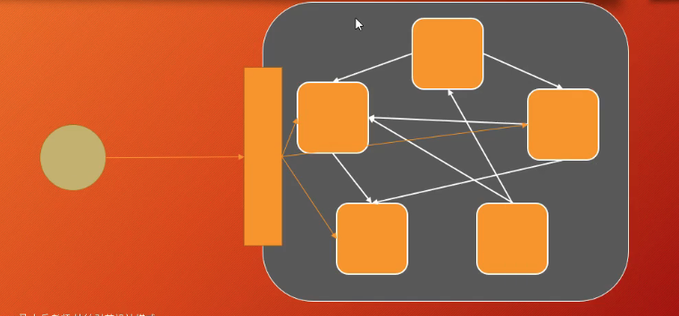
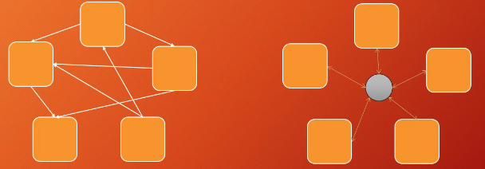
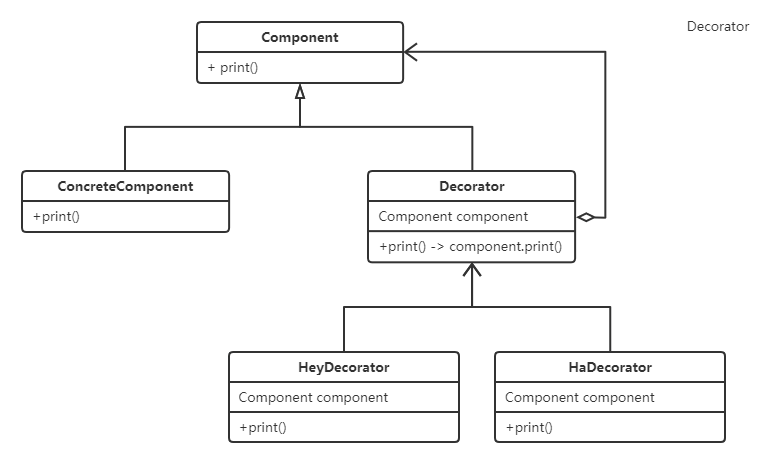
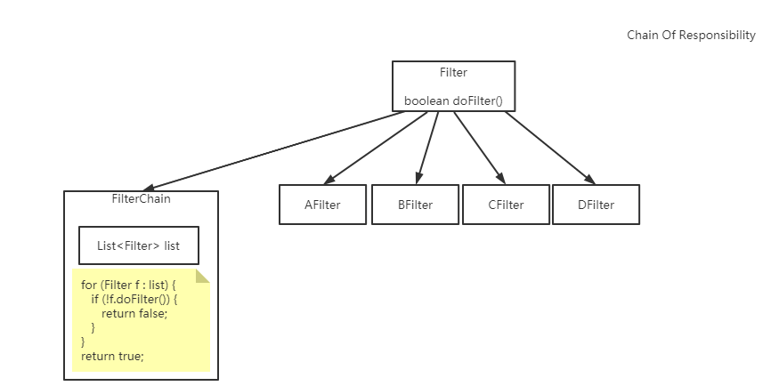
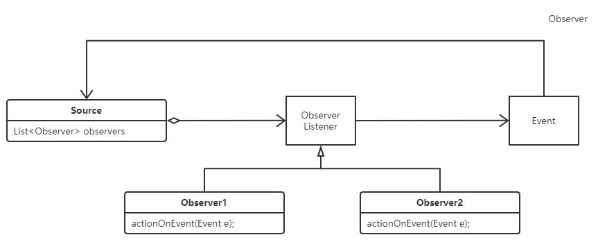
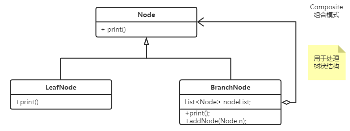
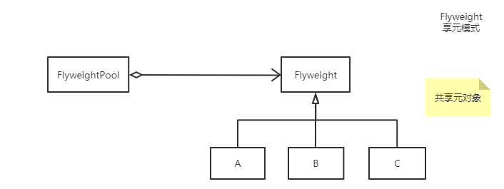
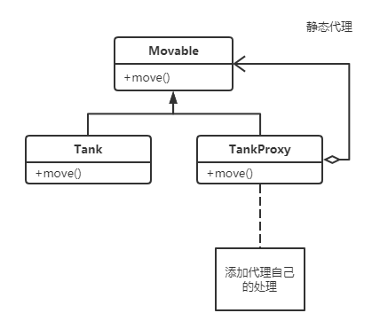
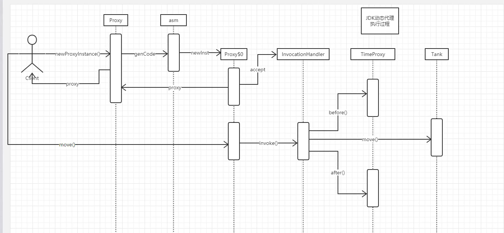

## 设计模式

### 01_单例模式 - Singleton

```java
/**
 * 饿汉单例
 */
public class Singleton_01 {
	
	private static final Singleton_01 INSTANCE = new Singleton_01();

	private Singleton_01() {}		// 单例模式的构造方法必须是private的
	
	public static Singleton_01 getInstance() {
		return INSTANCE;
	}

	
	public static void main(String[] args) {
		for (int i=0; i<100; i++) {
			new Thread(() -> {
				System.out.println(Singleton_01.getInstance());
			}).start();
		}
	}
}
```

```java
/**
 * double check lock 单例
 */
public class Singleton_05 {
	
	/**
	 * 这里必须要加volatile，防止指令重排序
	 * new Singleton_05() 的三个步骤:
	 * 		1. 开辟空间，成员变量赋初始值
	 * 		2. 成员变量赋默认值
	 * 		3. 栈变量指向堆对象
	 * 由于指令重排序的存在，导致2，3 两步可能出现指令重排序，这样当成员变量被赋初始值的时候，就会进入INSTANCE != null的判断，直接返回INSTANCE
	 */
	private static volatile Singleton_05 INSTANCE = null;
	
	private Singleton_05() {}
	
	public static Singleton_05 getInstance() {
		if (INSTANCE == null) {
			synchronized(Singleton_05.class) {
				if (INSTANCE == null) {
					INSTANCE = new Singleton_05();
				}
			}
		}
		return INSTANCE;
	}
	
	public static void main(String[] args) {
		for (int i=0; i<100; i++) {
			new Thread(() -> {
				System.out.println(Singleton_05.getInstance());
			}).start();
		}
	}
	
}

```

### 02_策略模式 - Strategy

- Comparator
- Comparable

一个接口，多个实现类



### 工厂模式 - Factory

#### 简单工厂(不算一个单独的设计模式)

```
public class SimpleVircleFactory {
	public Car createCar() {
		// process before createCar
		return new Car();
	}
	public Plane createPlane() {
		// process before createCar
		return new Plane();
	}
}
```

- 可扩展性并不好

#### 03_抽象工厂 - AbstractFactory

- 产品族维度容易扩展

```
Abstract产品A			A1, A2, A3, ...
Abstract产品B			B1, B2, B3, ...
Abstract产品C			C1, C2, C3, ...

AbstractFactory		fac1, 		fac2, 		fac3, ...
createA();			return A1;	return A2;	return A3;
createB();			return B1;	return B2;	return B3;
createC();			return C1;	return C2;	return C3;
```

#### 04_工厂方法 - FactoryMethod

- 产品维度容易扩展
- 其实就是特殊的抽象工厂

```
AbstractProduct		p1, 		p2, 		p3, ...
AbstractFactory		f1, 		f2, 		f3, ...
createP()			return p1;	return p2;	return p3;
```

### 05_门面 - Facade



### 06_调停者 - Mediator



- 消息中间件：MQ			解耦

### 07_装饰器 - Decorator

- 允许向一个现有的对象添加新的功能，同时又不改变其结构
- 用聚合代替继承



`new HeyDecorator(new HaDecorator(new ConcreteComponent())).print()`

### 08_责任链 - Chain Of Responsibility



### 09_观察者 - Observer

- 事件处理模型



### 10_组合模式 - Composite

- 树形结构



### 11_享元模式 - Flyweight



- 共享元对象，防止new出过多对象
- java里的String用的就是享元模式

### 12_代理模式 - Proxy

#### 12_01 静态代理



#### 12_02 动态代理



反射：通过二进制字节码分析类的属性和方法

```java
Proxy.newProxyInstance(ClassLoader loaderm
					   Class<?>[] interfaces,
					   InvocationHandler h);
```

- loader：与被代理对象同一个ClassLoader
- interfaces：生成的Proxy对象需要实现哪些接口
- h：调用时的处理器，interface