# JVM

## Part 01 虚拟机基础概念

***


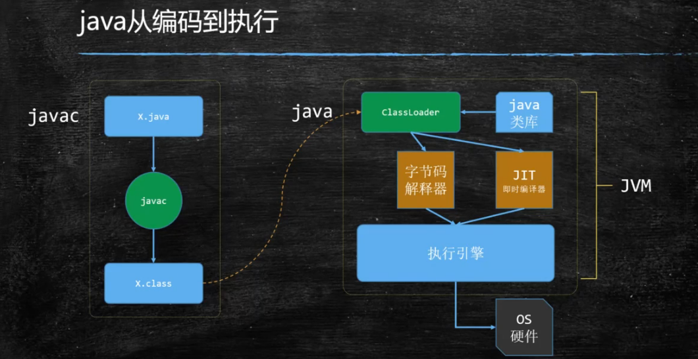

- jvm实际上是一种规范
  - java virtual machine specifications
- 虚构出来的一套计算机
  - 字节码指令集（汇编语言）
  - 内存管理：栈、堆、方法区等

## Part 02  class文件结构

## Part 03  内存加载过程

1. loading

   将class加载到内存

   **双亲委派**机制，主要出于安全问题来考虑

2. linking

   1. verification

      校验，看加载进来的class是否符合规范

   2. preparation

      将静态变量赋**默认值**

   3. resolution

      将常量池中用到的符号引用转换成内存地址

3. initializing

   静态变量赋初始值，调用静态代码块

> 当任何一个 .class文件被 load到内存中时，生成了两块内容：第一块内容是原有的 class文件的二进制码，第二块内容是一个Class对象，指向第一块

### Loading

#### 类加载器的层次

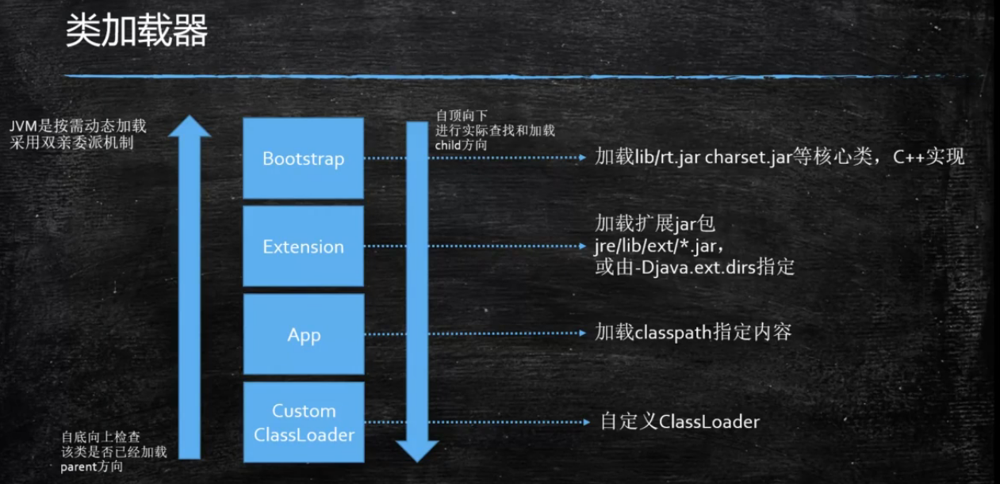

##### 双亲委派

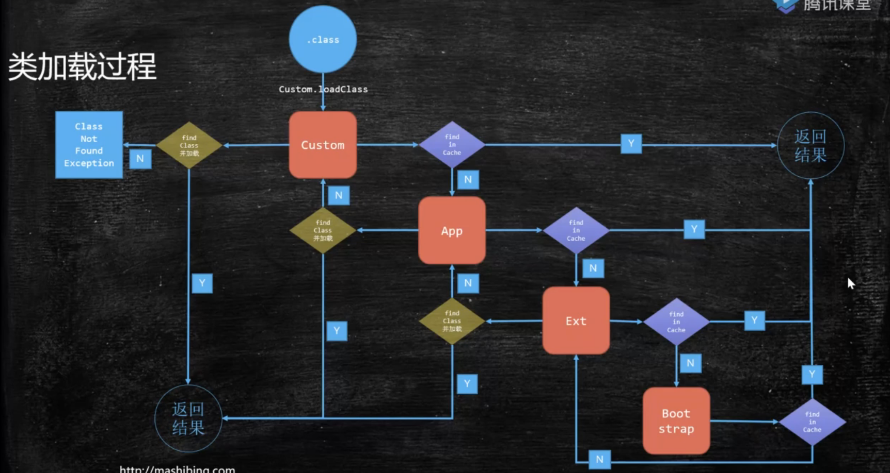

一个类要被加载时，先从最下层的ClassLoader（类加载器）开始，检查自己的缓存里是否有已经加载过的该类，若有，则返回结果，否则，通知自己的父ClassLoader，在父ClassLoader的缓存中查找。层层迭代，直至顶层，若顶层ClassLoader依然未找到，则查找本层的类中是否包含该类，若是，则加载，并返回结果，否则，通知下层ClassLoader进行加载，层层迭代，直至底层，若最底层ClassLoader在自己的应加载的类中依然未找到该类，则抛出ClassNotFoundException。

<font color="red">**父加载器不是加载器的加载器，也不是加载器的父类加载器**</font>

##### 为什么要进行双亲委派？

主要是为了安全，其次可以防止资源浪费

安全问题：如果没有双亲委派，则编程人员可以自定义java.lang.String进行加载，该类直接在CustomerClassLoader进行加载，就会覆盖掉原有的String，用户在使用这个String类的时候会发生安全问题。有了双亲委派机制后，CustomerClassLoader要加载java.lang.String时，会先去上层ClassLoader检查，发现已经加载，则会直接返回结果，解决了安全问题。

#### 类加载器的范围

来自Launcher源码

- sun.boot.class.path

  Bootstrap.ClassLoader加载路径

- java.ext.dirs

  ExtensionClassLoader加载路径

- java.class.path

  AppClassLoader加载路径

#### ClassLoader源码解析

findInCache -> parent.loadClass() ->findClass()

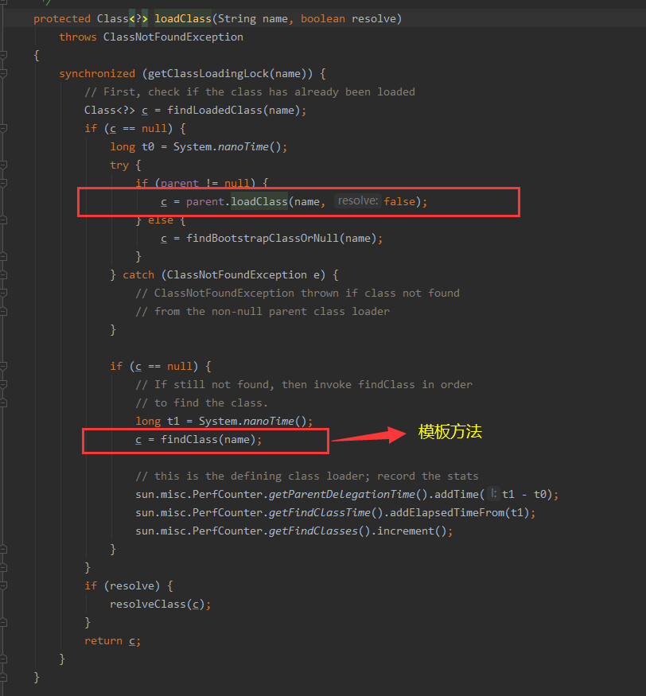

#### 自定义类加载器

- 继承ClassLoader
- 重写模板方法findClass
  - 调用defineClass
- 自定义类加载器加载自加密的class
  - 防止反编译
  - 防止篡改

#### LazyLoading

- 严格讲应该叫LazyInitializing
- JVM规范并没有规定何时加载，但严格规定了什么时候必须初始化

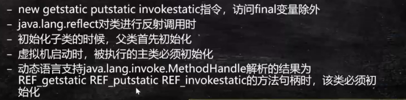

#### 混合执行

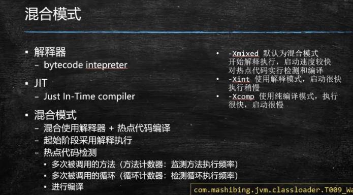

### Linking

#### Verification

- 检查文件是否符合jvm规定

#### Preparation

- 给静态成员变量赋默认值

#### Resolution

- 将类、方法、属性等符号引用解析为直接引用
- 常量池中的各种符号引用解析为指针、偏移量等内存地址的直接引用

### Initializing

- 给静态成员变量赋初始值

>new对象也是分为两步的：
>
>	1. 申请一块内存，内存中成员变量赋默认值
> 	2. 调用类的构造方法，将栈内存指向堆内存，成员变量赋初始值

## Part 04  运行时内存结构

JMM：Java Memory Model

### 硬件层次

#### 存储器的层次结构

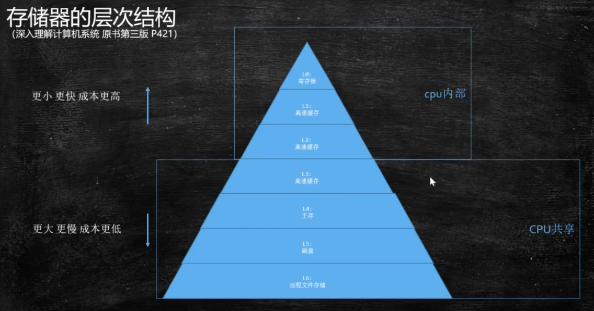

CPU在寻找资源时，先去离自己比较近的位置寻找，找不到继续向下。当找到了需要的资源时，放入上一级的缓存中，方便下次寻找

#### 硬件层数据一致性

协议很多，intel用MESI，让各个CPU的缓存保证数据的一致性

> MESI：在读取数据的时候，会记录这个数据的状态，即CPU每个Cache line会标记四种状态
>
> 1. Modified：我修改过
> 2. Exclusive：我用的时候别的线程没有操作，没有读
> 3. Shared：我读的时候别的人也读了
> 4. Invalid：我读的时候别人改过了

现在CPU的数据一致性实现是通过缓存锁(MESI...) + 总线锁实现的

##### Cache line(缓存行)

读取缓存以cache line为基本单位，目前是64byte

位于同一缓存行的两个不同数据，被两个不同CPU锁定，会产生互相影响的伪共享问题

使用缓存行的对齐能够提高效率

### 乱序问题

CPU为了提高指令的执行效率，会在一条执行过程中(比如去内存中读数据(慢100倍))，去同时执行另一条指令，前提是，两条指令没有依赖关系

#### 合并写

写操作也可以进行合并(Write Combining Buffer)

#### 乱序问题的证明

JVM/jmm/Disorder.java

#### 有序性保障

##### CPU内存屏障(x86)

屏障两侧的指令不能重排

- sfence：save / store fence | 在sfence指令前的写操作必须在sfence指令之后的写操作前完成
- lfence：load fence | 在lfence指令前的读操作必须在lfence指令后的读操作前完成
- mfence：mix fence | 在mefence指令前的读写操作必须在mfence指令后的读写操作前完成

- 原子指令，如x86上的"lock..."指令是一个FullBarrier，执行时会锁住内存子系统来确保执行顺序，甚至跨多个CPU。Software Locks通常使用了内存屏障或原子指令来实现变量可见性和保持程序顺序

##### JVM层级的规范

- LoadLoad屏障
- StoreStore屏障
- LoadStore屏障
- StoreLoad屏障

#### volatile的实现细节

##### 1. 字节码层面

加上一个标记ACC_VOLATILE

##### 2. JVM层面

volatile内存区的读写都加屏障

```
StoreStoreBarrier
volatile写操作
StoreLoadBarrier
```

```
LoadLoadBarrier
volatile读操作
LoadStoreBarrier
```

##### 3. OS和硬件层面

windows：lock指令实现

#### synchronized的实现细节

##### 1. 字节码层面

ACC_SYNCHRONIZED

```java
void n() {
	synchronized(this) {// monitorenter
	//monitorexit(发生在抛出异常的情况下)
	}// monitorexit
}
```

##### 2. JVM层面

C，C++调用了操作系统提供的同步机制

##### 3. OS和硬件层面

X86：lock指令 compare and exchange

>Questions:
>
>1. 请解释一下对象的创建过程？
>
>  1. .class文件load到内存：loading -> linking（verification->preparation->resolution） -> initializing
>  2. 申请对象内存
>  3. 成员变量赋默认值
>  4. 调用构造方法<init>
>     1. 成员变量顺序赋初始值
>     2. 执行构造方法语句
>
>2. 对象在内存中的存储布局？（hospot，64位机器）
>
>  **普通对象**
>
>  1. 对象头（markword）   8字节
>
>  2. ClassPointer指针，指向Class对象，一般为8字节，如果-XX:+UseCompressedClassPointers开启，则为4字节
>
>  3. 实例数据：（成员变量）
>
>     引用类型：一般为8字节，若-XX:+UseCompressedOops开启为4字节
>
>  4. Padding对齐，补齐为8的倍数
>
>  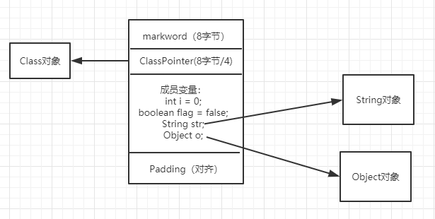
>
>  数组对象
>
>   	a. markword
>
>   	b. ClassPointer
>
>  ​	 c.  数组长度
>
>   	d. 数组数据
>
>  ​	 e. Padding
>
>3. 对象头具体包括什么？
>
>  1. 对象的HashCode
>  2. synchronzied    2 bits
>  3. GC信息（分代的年龄） 4bits
>     
>1. 为什么GC年龄默认为15?		最大为15
>     
>4. 对象怎么定位？
>
>  1. 句柄池
>
>     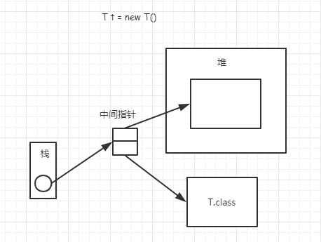
>
>  2. 直接指针(hospot实现)
>
>     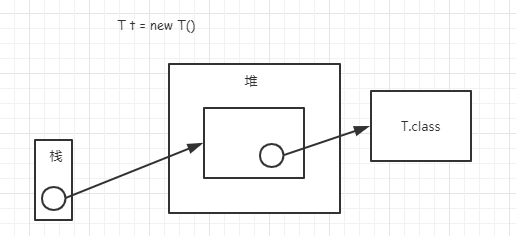
>
>5. Object o = new Object()占几个字节？
>
>  16字节：markword  8  + ClassPointer  8/4 + Padding 0/4   = 16 bytes

> IdentityHashCode的问题：
>
> 如果一个对象已经计算过IdentityHashCode，则无法进入到偏向锁的状态

## Part 05  JVM运行时数据区和常用指令

> Question:
>
> ```java
> public class Test {
> 	public static void main(String[] args) {
> 		int i = 8;
> 		i = i++;   // -> 8
> 		// i = ++i; 	// -> 9
> 		System.out.println(i);
> 	}
> }
> ```

### Runtime Data Area

***

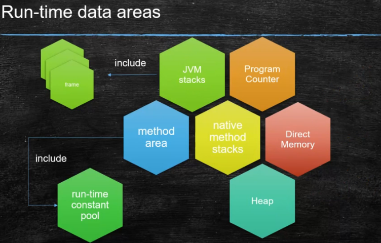

#### Program Counter

程序计数器，存放下一条指令的位置

> 虚拟机的运行，类似于这样的循环：
>
> ```
> while (not end) {
> 	取PC中的位置，找到对应位置的指令
> 	执行该指令
> 	PC++
> }
> ```

#### Method Area

1. Perm Space(< 1.8)

   字符串常量位于PermSpace，FGC不会清理

   大小启动的时候指定，不能变

2. Meta Space(>= 1.8)

   字符串常量位于堆，会触发FGC清理

#### Direct Memory

JVM可以直接访问的内核空间的内存（OS直接管理的内存），NIO，提高效率，实现零拷贝

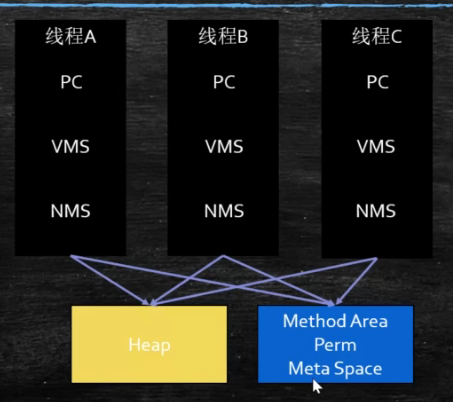

#### JVM Stack

JVM Stack里装着一个个的栈帧，一个方法对应一个栈帧

##### 栈帧Frame

> A frame is used to store data and partial results, as well as to perform dynamic linking, return values for methods, and dispatch exceptions.

每个栈帧中包含以下内容：

1. Local Variable Table

2. Operand Stack

3. Dynamic Linking

   从常量池找到对应的地址

4. return address

   方法a调用了方法b，b的返回值放在什么地方

### 常用指令

#### load

压栈到Operand Stack

#### store

出栈赋值

#### invoke

1. InvokeStatic - 调用静态方法

2. InvokeVirtual

   自带多态

3. InvokeInterface

4. InvokeSpecial

   调用的是可以直接调用的，不用多态的方法

5. InvokeDynamic

   jvm最难的指令，lambda表达式或者反射或者其他动态语言，lambda表达式会产生很多自己的内部类

## Part 06  GC与调优（重点）

什么是垃圾？

没有任何引用指向的对象


2020/1/11直播  G1+算法（还有三次）

CMS

- Concurrnet Mark Sweep

- a mostly concurrent, low-pause collector

- 4 phase

  1. initial mark  			初始标记

     先找到GC roots      STW   时间会非常短

  2. concurrent mark   并发标记

     最耗时间

  3. remark  重新标记

     STW

  4. concurent sweep  并发清理

     （和工作线程一起清理，会产生浮动垃圾，会在下一次GC的时候清理掉）

G1 - Garbage First

G1的分代模型 - 逻辑上分代，物理上不分代

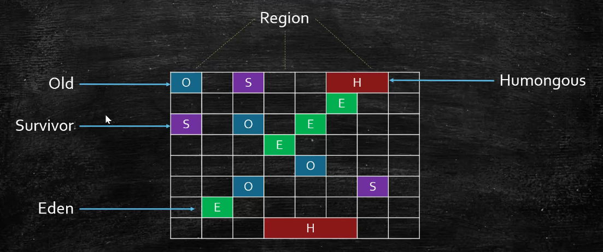

G1的内存区域与不是固定的E或者O


基本概念

- card table - 好多个card的一张总表
- card - dirty

CSet - Collection Set

- 要被回收的东西

RSet - Remembered Set

记录了其他Region中的对象到本Region的引用

Rset的价值在于，使得垃圾收集器不需要扫描整个堆就能找到谁引用了当前分区中的对象，只需要扫描Rset即可

G1特点：

- 并发收集
- 压缩空闲

三色标记，颜色指针


阿里的多租户JVM

- 每租户单空间
- session based GC

GC何时触发

- YGC
  1. Eden空间不足
  2. 多线程并发执行
- FGC
  1. Old空间不足

G1也会有FGC - 对象分配不下了就会FGC

​	jdk10以前是串行的，jdk10之后是并行的。

>  如果G1产生FGC，应该怎么做？
>
> ​	1. 提高内存
>
> ​	2. 提高CPU性能（回收的快，业务逻辑产生对象的速度固定，垃圾回收越快，内存空间越大）
>
> ​	3. 降低MixedGC的阈值，让MixedGC提前产生（默认45%）

G1中的MixedGC   =   CMS

- 默认值45%
- 当O超过这个值的时候，就会出现MixedGC

三色标记法：

- 白色：没有标记到
- 灰色：自己标记完了，fields没有标记到
- 黑色：自己标记完了，fields标记完了

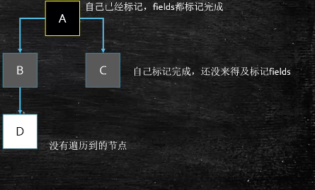

漏标：1. 黑色指向了白色，2. 灰色指向白色的没了。如果不对黑色重新进行扫描，则会漏标，会把白色对象D当作没有新引用从而回收掉

解决办法：打破上述两个条件即可

1. incremental update - 增量更新，关注引用的增加，把黑色重新标记为灰色，下次重新扫描属性

2. SATB snapshot at the beginning ：（G1使用）

   关注引用的删除，当B->D消失时，要把这个**<font color="red">引用</font>**放入到堆栈信息中，下次扫描时再次扫描这个引用

   >为什么G1使用SATB？

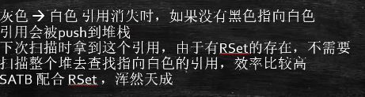

RSet与赋值效率问题

- 由于RSet的存在，那么每次给对象赋引用的时候，就得做一些额外的操作
- 指的是在RSet中做一些额外的记录(在GC中被称为写屏障)
- 这个**<font color="red">写屏障</font>**不等于**内存屏障**