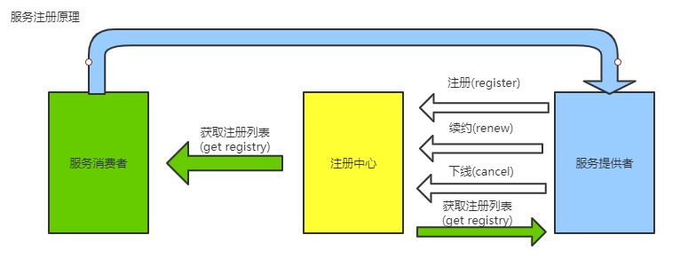

# Spring Cloud

## 微服务

- 好处：
  1.  服务聚焦，聚焦于业务，松耦合
  2.  开发简单，效率高
  3.  方便部署维护
- 坏处：
  1.  增加了系统间通信成本
  2.  数据一致性问题，分布式事务问题
  3.  服务数增加，运维压力大

## Spring Cloud和Dubbo

|            | dubbo                                 | spring cloud |           |
| ---------- | ------------------------------------- | ------------ | --------- |
| 背景       | 国内影响大                            | 国外影响大   | 平手      |
| 社区活跃度 | 低                                    | 高           | cloud胜出 |
| 架构完整度 | 不完善(dubbo有些不提供，需要用第三方) | 比较完善     | cloud胜出 |
| 学习成本   | dubbo需要配套学习                     | 无缝spring   | cloud胜出 |

## 注册中心

​		服务管理，维护注册表，心跳检测机制

- <strong>迪米特原则(别和陌生人说话)：最少知识原则，一个对象应当对其他对象有尽可能少的了解</strong>

## 服务注册原理

#### eureka自我保护机制