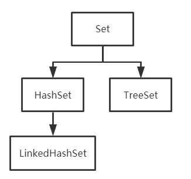

### List

#### Vector

- Vector也是List接口的一个子类实现
- Vector和ArrayList一样，底层都是使用数组实现的
- 区别：
  - ArrayList是线程不安全的，效率高，Vector是线程安全的，效率低
  - ArrayList在进行扩容的时候，是扩容1.5倍，Vector在进行扩容的时候，是扩容2倍

### Set

- Set接口存储一组唯一，无序的对象
- 存入和取出的顺序不一定一致
- 操作数据的方法和List类似，但**Set中不存在get()方法**

#### HashSet

采用HashTable哈希表存储结构

- 优点：添加速度快，查询速度快，删除速度快
- 缺点：无序
- LinkedHashSet
  - 采购哈希表存储结构，同时使用链表维护次序
  - 有序（添加顺序）

#### TreeSet

- 采用二叉树（红黑树）的存储结构
- 底层是TreeMap
- 优点：有序(排序后的升序)，查询速度比List快
- 缺点：查询速度没有HashSet快

### Map

#### HashMap和HashTable的 区别

1. HashMap是线程不安全的，效率比较高；HashTable是线程安全的，效率低
2. HashMap中key和value都可以为空，HashTable中不允许为空

#### TreeMap

- 底层使用红黑树进行实现

>红黑树和AVL树（平衡二叉查找树）：
>
>红黑树插入和删除操作比AVL树快，AVL树检索速度比红黑树快

#### HashMap源码

##### HashMap初始值为2的n次幂

1. 方便进行&操作，提高效率，&要比取模运算效率要高

   hash & (initCapacity - 1)

2. 在扩容之后涉及到元素的迁移过程，迁移的时候只需要判断二进制的前一位是0或者是1即可。如果是0，表示新数组和旧数组的下标位置不变，如果是1，只需要将索引位置加上旧的数组索引

##### 1.7源码知识点

- 数组 + 链表

1. 默认初始容量：1 << 4
2. 加载因子：0.75（扩容用）
3. put操作
   1. 设置值，计算hash
   2. 扩容操作
   3. 数据迁移的过程

##### 1.8源码知识点

- 数组 + 链表 + 红黑树

