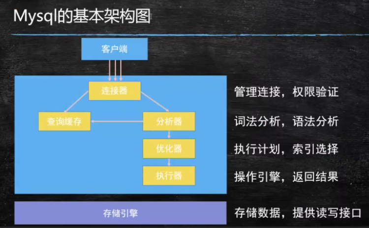
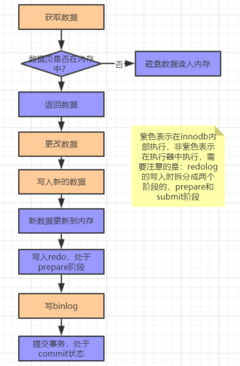

### SQL

#### 查询操作

1. exists

   - exists(sub-query), 当exists中的子查询语句能够查到对应结果的时候，意味着条件满足

   - 相当于双层for循环

   - ```sql
     select * from emp e
     where exists (
     	select deptno from dept d 
     	where 
     		(d.deptno = 10 or d.deptno = 20) 
     		and e.deptno = d.deptno);
     ```

2. escape

   - 可以自己规定转义字符，一般结合like使用
   - 使用like的时候要慎重，因为like的效率比较低
   - 使用like的时候可以参考使用索引，但是要求不能用%开头

3. order by
   - 每次在执行order by的时候相当于是做了全排序，效率比较低
   - 会比较耗费系统资源，因此应该选择在业务不太繁忙的时候进行
4. 集合操作
   - 并集  union
     - 两个集合中所有数据都显示，但不包含重复的数据
   - 全集  union all
     - 两个集合中所有数据都显示，不会去重
   - 交集  intersect
   - 差集  minus

#### 函数

分为组函数和单行函数

组函数又叫聚合函数，用于对多行数据进行操作，并返回一个单一的结果，组函数仅可用于选择列表或查询的having字句

单行函数对一单个数值进行操作，并返回一个值

### 视图 VIEW

- 视图(view)，也称虚表，不占用物理空间，这个也是相对概念，应为视图本身的定义语句还是要存储在数据字典里的。视图只有逻辑定义，每次使用的时候，只是重新执行SQL。
- 视图是从一个或多个实际表中获得的，这些表的数据存放在数据库中，那些用于产生视图的表叫做该视图的基表。一个视图也可以从另一个视图中产生。
- 视图的定义存在数据库中，与此定义相关的数据并没有再存一份于数据库中，通过视图看到的数据存放在基表中。
- 视图看上去非常像数据库的物理表，对它的操作同任何其他表一样，当通过视图修改数据时，实际上是在改变基表中的数据；相反地，基表数据的改变也会自动反映在由基表产生的视图中，由于逻辑上的原因，有些Oracle视图可以修改对应的基表，有些则不能（仅仅能查询）。
- 在查询的时候，不需要再写完全的select查询语句，只需要简单的写从视图中查询的语句就可以了。
- 当视图不再需要的时候，用"drop view"撤销，删除视图不会导致数据的丢失，因为视图是基于数据库的表之上的一个查询定义。

### 事务

#### 事务处理

- 事务（Transaction）是一个操作序列。这些操作要么都做，要么都不做，是一个不可分割的工作单位，是数据库环境中的逻辑工作单位。
- 事务是为了保证数据库的完整性
- 事务不能嵌套

#### 事务的四个特性：ACID

- **原子性(Atomicity)**：一个原子事务要么完整执行，要么干脆不执行。这意味着，工作单元中的每项任务都必须正确执行。如果有任意一个任务执行失败，则整个工作单元或事务就会被中止。即此前对数据所作的任何修改都将被撤销。如果所有任务都被成功执行，事务就会被提交，即对数据所作的修改将会是永久性的。
- **一致性(Consistency)**：一致性代表了底层数据存储的完整性。它必须由事务系统和应用开发人员共同来保证。事务系统通过保证事务的原子性，隔离性和持久性来满足这一要求；应用开发人员则需要保证数据库有适当的约束（主键，引用完整性等），并且工作单元中所实现的业务逻辑不会导致数据的不一致，即数据预期所表达的现实业务情况不相一致。
- **隔离性(Isolation)**：隔离性意味着事务必须在不干扰其他进程或事务的前提下独立执行。换言之，在事务或工作单元执行完毕之前，其所访问的数据不能受系统其他部分的影响
  - 严格的隔离性会导致效率降低，在某些情况下为了提高程序的执行效率，需要降低隔离的级别

> 隔离级别：从上往下，隔离级别越来越高，意味着数据越来越安全
>
> 1. 读未提交(read uncommitted)：会产生“脏读”问题
> 2. 读已提交(read committed)：不会产生“脏读”问题，但是会产生不可重复读的问题
> 3. 可重复读(repeatable read)
> 4. 序列化(serializable)
>
> 数据不一致的问题：
>
> 1. 脏读：A未提交事务，但是B会读到A的修改
>
>  	2. 不可重复读：同一个事务进行两次相同查询会出现数据不一致的问题。
>
> ```sql
> A: start transation;
> B: start transation;
> A: update ...
> B: select ...
> -- B读不到A的修改
> A: commit;
> B: select ...
> --- B读到了A的修改
> ```
>
> 3. 幻读：A提交了事务，但是B没有看到事务，但是在执行语句时会受到A事务的影响
>
> > insert和update会产生幻读，read不会产生幻读
>
> ```sql
> A: start transation;
> B: start transation;
> A: insert into user values (5, '555');
> B: select * from user
> -- B看不到id为5的数据
> B: insert into user values (5, "qqq");
> error: 主键重复
> ```
>
> |          | 脏读 | 不可重复读 | 幻读 |
> | :------: | :--: | :--------: | :--: |
> | 读未提交 |  √   |     √      |  √   |
> | 读已提交 |  ×   |     √      |  √   |
> | 可重复读 |  ×   |     ×      |  √   |
> |  序列化  |      |            |      |

- **持久性(Durability)**：持久性表示在某个事务的执行过程中，对数据所作的所有改动都必须在事务成功结束前保存至某种物理<font color="red">存储设备</font>。这样可以保证，所作的修改在任何系统瘫痪时不至于丢失。

> Question：四个特性中，哪个是最关键的?
>
> ​	所有的特性中都是为了保证数据的一致性，所以一致性是最终的追求。
>
> ​	**事务中的一致性是通过原子性、隔离性、持久性来保证的**

### 反射

#### 概述

- Java反射机制是在运行状态中，对于任意一个类，都能够知道这个类的所有属性和方法；对于任意一个对象，都能够调用它的任意一个方法和属性；这种动态获取的信息以及动态调用对象的方法的功能成为java语言的**反射**机制
- 要想剖析一个类，必须要先获取到该类的字节码文件对象。而解剖使用的就是Class类中的方法。所以先要获取到每一个字节码文件对应的Class类型的对象。
- Class类的实例表示正在运行的Java应用程序中的类和接口，每个类只会产生一个Class对象，在类加载的时候自动创建

#### 获取Class对象的三种方式

1. `Class.forName("com.xxx.xxx.Xxx");`
2. 类名.class   `Class clazz = Xxx.class;`
3. 对象的getClass()方法  `Class clazz = new Xxx().getClass();`

> 如果是一个基本数据类型：
>
> 4. `Class<Integer> class = Integer.TYPE;`

### 索引

> 常见面试题
>
> - 数据库中最常见的慢查询优化方式是什么？
> - 为什么加索引能优化慢查询？
> - 你知道哪些数据结构可以提高查询速度？
> - 那这些数据结构既然都能优化查询速度，Mysql为何选择使用B+树？

- 索引是为了加快对数据的搜索速度而设立的。索引是方案(schema)中的一个数据库对象，与表独立存放

- 作用：在数据库中用来加速对表的查询，通过使用快速路径访问方法快速定位数据，减少了磁盘的I/O

- sql中的索引是非显示索引，也就是在索引创建以后，在用户撤销它之前不会再用到该索引的名字，但是索引再用户查询时会自动起作用

- 索引的创建有两种情况

  1. 自动：当在表上定义一个primary key或者unique约束条件时，oracle数据库自动创建一个对应的唯一索引
  2. 手动：用户可以创建索引以加速查询
- 索引是存放在磁盘中的

#### 开发中使用索引的要点：

1. 索引改善检索操作的性能，<font color="red">但降低数据插入、修改和删除的性能</font>。在执行这些操作时，DBMS必须动态地更新索引
2. 索引数据可能要占用大量的存储空间
3. <font color="red">并非所有的数据都适合索引。唯一性不好的数据（如省）从索引得到的好处不比具有更多可能值的数据（如姓名）从索引得到的好处多</font>
4. 索引用于数据过滤和数据排序，如果你经常以某种特定是顺序排序数据，则该数据可能是索引的备选
5. 可以在索引中定义多个列（如省加城市），这样索引只在以省加城市的顺序排序时有用。如果想按城市排序，则这种索引没有用处。

#### 聚簇索引和非聚簇索引

不同的存储引擎，数据文件和索引文件存放的位置是不同的，因此有了分类：

> - 聚簇索引：数据和索引放在一起（Innodb）
>
>   - .frm：存放的是表结构
>   - .ibd：存放数据文件和索引文件
>
>   > Attention：mysql的innodb存储引擎默认情况下会把所有的数据文件放到表空间中，不会为每个单独的表保存一份数据文件，如果需要将每一个表单独使用文件保存，设置如下属性：
>   >
>   > `set global innodb_file_per_table = on`
>
> - 非聚簇索引：数据和索引单独一个文件（MyISAM）
>
>   - .frm：存放表结构
>   - .MYI：存放索引数据
>   - .MYD：存放实际数据

#### AVL树和红黑树

- AVL树

  左右子树高度差不超过1，插入速度比较低，查询速度比较高

- 红黑树

  AVL树的升级，损失一部分查询速度，提升插入的性能，最低子树和最高子树之差小于2倍即可，插入的时候不需要多次的旋转操作，加入了变色的特性，满足插入和查询性能的平衡。

**二叉树及其N多的变种都不能支撑索引，原因是树的深度无法控制或插入数据的性能比较低**

#### B树

- 所有键值分布在整棵树中
- 搜索有可能在非叶子节点结束，在关键字全集内做一次查找，性能逼近二分查找
- 每个节点最多拥有m个子树
- 根节点至少有2个子树
- 分支节点至少拥有 m/2 棵子树（除根节点和叶子节点外都是分支节点）
- 所有叶子节点都在同一层，每个节点最多可以有m-1个key，并且以升序排列

#### B树的缺点

- 每个节点都有key，同时也包含data，而每个页存储空间是有限的，如果data比较大的话会导致每个节点存储的key数量变小
- 当存储的数据量很大的时候回导致深度较大，增大查询时磁盘io次数，进而影响查询性能

#### mysql索引数据结构——B+树

B+树是在B树的基础之上做的一种优化，变化如下：

1. B+树每个节点可以包含更多的节点，这么做的原因有两个，第一个原因是为了降低树的高度，第二个原因是将数据范围变为多个区间，区间越多，数据检索越快；
2. 非叶子节点存储key，叶子节点存储key和数据；
3. 叶子节点两两指针相互连接（符合磁盘的预读特性），顺序查询性能更高

> Attention：在B+树上有两个头指针，一个指向根节点，另一个指向关键字最小的叶子节点，而且所有叶子节点（即数据节点）之间是一种链式环结构，因此可以对B+树进行两种查找运算：一种是对于主键的范围查找和分页查找，另一种是从根节点开始，进行随即查找。

> - InnoDB是通过B+树结构对主键创建索引，然后叶子节点中存储记录，如果没有主键，那么会选择唯一键，如果没有唯一键，那么会生成一个6位的row_id来作为主键
> - 如果创建索引的键是其他字段，那么在叶子节点中存储的是该记录的主键，然后再通过主键索引找到对应的记录，称之为<font color="red">**回表**</font>

#### 索引的分类

- 主键索引

  主键是一种唯一性索引，但它必须指定为primary_key，每个表只能有一个主键

- 唯一索引

  索引列的所有值都只能出现一次，即必须唯一，值可以为空

- 普通索引

  基本的索引类型，值可以为空，没有唯一性的索引。（<font color="red">覆盖索引</font>）

  > 覆盖索引：根据索引查询主键，可以不用进行回表操作，少遍历一次B+树

- 全文索引

  全文索引的索引类型位FULLTEXT，全文索引可以在varchar，char，text类型的列上创建

  > MyISAM支持，Innodb5.6之后支持

- 组合索引

  多列值组成一个索引，专门用于组合搜索。（<font color="red">最左匹配原则</font>）

#### 索引下推

> table emp有三个字段：id，name，age
>
> 创建两个索引：name，age
>
> 执行sql：select * from emp where name = 'zhangsan' and age = 10;
>
> 1. 不使用索引下推
>
>    只匹配name = 'zhangsan'，比如匹配到4条数据，进行回表操作，再过滤age = 10的记录
>
> 2. 使用索引下推
>
>    先匹配name = 'zhangsan'，再匹配age = 10，将过滤后的数据进行回表操作

#### mysql存储引擎对比

|              |   MyISAM   |          InnoDB           |
| :----------: | :--------: | :-----------------------: |
|   索引类型   | 非聚簇索引 |         聚簇索引          |
|   支持事务   |     否     |            是             |
|   支持表锁   |     是     |            是             |
|   支持行锁   |     否     |            是             |
|   支持外键   |     否     |            是             |
| 支持全文索引 |     是     |      是（after 5.6）      |
| 适合操作类型 | 大量select | 大量 insert delete update |

#### 索引维护

索引在插入新的值的时候，为了维护索引的有序性，必须要维护，在维护索引的时候需要分以下几种情况

1. 如果插入一个比较大的值，直接插入即可，几乎没有成本；
2. 如果插入的是中间的某一个值，需要逻辑上移动后续的元素，空出位置；
3. 如果需要插入的数据页满了，就需要单独申请一个新的数据页，然后移动部分数据过去，叫做页分裂，此时性能会受影响同时空间的使用率也会降低，出页分裂之外还包含页合并

<font color="red">**尽量使用自增主键作为索引**</font>

### Mysql基本架构



> mysql8.0后不再具有查询缓存组件

#### 连接器

- 负责跟客户端建立连接，获取权限、维持和管理连接
  - 用户名密码验证
  - 查询权限信息，分配对应的权限
  - 可以使用show processlist查看现在的连接
  - 如果太长时间没有动静，就会自动断开，通过wait_timeout控制，默认8小时
- 连接分为两类
  - 长连接：推荐使用，但是要周期性的断开长连接（连接池）
  - 短连接

#### 查询缓存

- 当执行查询语句的时候，会先去查询缓存中查看结果，之前执行过的sql语句及其结果可能以key-value的形式存储在缓存中，如果能找到则直接返回，如果找不到，就继续执行后续的阶段
- <font color="red">**不推荐使用查询缓存**</font>
  - <font color="red">查询缓存的失效比较频繁，只要表更新，缓存就会清空</font>
  - <font color="red">缓存对应新更新的数据的命中率比较低</font>

#### 分析器

- 词法分析：mysql需要把输入的字符串进行识别每个部分代表什么意思
  - 把字符串 T 识别成表名 T
  - 把字符串 id 识别成列 id
- 语法分析：根据语法规则判断这个sql语句是否满足mysql的语法，如果不符合就会报错“You have an error in your SQL synta”

#### 优化器

- 在具体执行sql语句之前，要先经过优化器的处理
  - 当表中有多个索引的时候，决定用哪个索引
  - 当sql语句需要做多表关联的时候，决定表的连接顺序
  - ......
- 不同的执行方式对sql语句的执行效率影响很大
  - RBO：基于规则的优化
  - CBO：基于成本的优化

#### 执行器

nothing....

### Mysql日志

#### Redo Log - InnoDB存储引擎的日志

- 当发生数据修改的时候，InnoDB引擎会先将记录写道redo log中，并更新内存，此时更新就算是完成了。同时InnoDB引擎会在合适的时机将记录操作到磁盘中

  > WAL: Write Ahead Log，预写日志，用于提高性能

- Redo Log是固定大小的，是循环写的过程

- 有了Redo Log之后，InnoDB就可以保证即使数据库发生异常重启，之前的记录也不会丢失，叫做crash-safe

#### Undo Log

- Undo Log是为了实现事务的原子性，在MySQL数据库InnoDB存储引擎中，还用Undo Log老师先多版本并发控制（MVCC）
- 在操作任何数据之前，首先将数据备份到一个地方（这个存储数据备份的地方成为Undo Log），然后进行数据的修改。如果出现了错误或者用户执行了RollBack语句，系统可以利用Undo Log中的备份将数据恢复到事务开始之前的状态
- Attention：Undo Log是逻辑日志，可以理解为：
  - 当delete一条记录时，Undo Log中会记录一条对应的insert记录
  - 当insert一条记录时，Undo Log中会记录一条对应的delete记录
  - 当update一条记录时，它会记录一条对应相反的update记录

#### binlog - 服务端的日志文件

> 默认不开启

- binlog是server层的日志，主要做mysql功能层面的事情
- 与Redo Log的区别：
  1. redo是InnoDB独有的，binlog是所有引擎都可以使用的
  2. redo是物理日志，记录的是在某个数据页上做了什么修改，binlog是逻辑日志，记录的是这个语句的原始逻辑
  3. redo是循环写的，空间会用完，binlog是可以追加写的，不会覆盖之前的日志信息
- binlog中会记录所有的逻辑，并且采用追加写的方式
- 一般在企业中数据库会有备份系统，可以定期执行备份，备份周期可以自己设置
- 恢复数据的过程
  1. 找到最近一次的全量备份数据
  2. 从备份的时间点开始，将备份的binlog取出来，重放到要恢复的那个时刻

### 数据更新的流程

1. 执行器先从引擎中找到数据，如果在内存中直接返回，如果不在内存中则查询后返回
2. 执行器拿到数据之后会先修改数据，然后调用引擎接口重新吸入数据
3. 引擎将数据更新到内存，同时写数据到redo中，此时处于prepare阶段，并通知执行器执行完成，随时可以操作
4. 执行器生成这个操作的binlog
5. 执行器调用引擎的事务提交接口，引擎把刚刚写完的redo改成commit状态，更新完成



> Question : redo log为什么要分为两阶段提交？
>
> - **<font color="red">先写redo log，后写binlog：</font>**假设在redo log写完，binlog还没有写完的时候，mysql进程异常重启。由于redo log写完之后，即使系统崩溃，仍然能够把数据恢复回来，所以恢复后这一行的c的值是1，但是由于binlog没写完就crash了，这时候binlog里面就没有记录这个语句。因此之后备份日志的时候，存起来的binlog里面就没有这条语句。然后就会发现，如果需要用这个binlog来恢复临时库的话，由于这个语句的binlog丢失，这个临时库就会少了这一次的更新，恢复出来的这一行c的值就是0，与原库的值不同。
> - **<font color="red">先写binlog后写redo log：</font>**如果在binlog写完之后crash，由于redo log还没写，崩溃恢复以后这个事务无效，所以这一行c的值的0。但是binlog里面已经记录了“把c从0改成1”这个日志。若以，在之后用binlog来恢复的时候就多了一个事务出来，恢复出来的这一行c的值就是1，与原库的值不同。