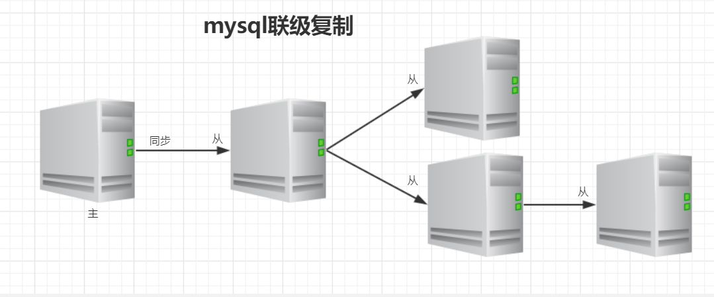

# 数据库

## SQL

### 查询操作

1. exists

   - exists(sub-query), 当exists中的子查询语句能够查到对应结果的时候，意味着条件满足

   - 相当于双层for循环

   - ```sql
     select * from emp e
     where exists (
     	select deptno from dept d 
     	where 
     		(d.deptno = 10 or d.deptno = 20) 
     		and e.deptno = d.deptno);
     ```

2. escape

   - 可以自己规定转义字符，一般结合like使用
   - 使用like的时候要慎重，因为like的效率比较低
   - 使用like的时候可以参考使用索引，但是要求不能用%开头

3. order by
   - 每次在执行order by的时候相当于是做了全排序，效率比较低
   - 会比较耗费系统资源，因此应该选择在业务不太繁忙的时候进行
4. 集合操作
   - 并集  union
     - 两个集合中所有数据都显示，但不包含重复的数据
   - 全集  union all
     - 两个集合中所有数据都显示，不会去重
   - 交集  intersect
   - 差集  minus

### 函数

分为组函数和单行函数

组函数又叫聚合函数，用于对多行数据进行操作，并返回一个单一的结果，组函数仅可用于选择列表或查询的having字句

单行函数对一单个数值进行操作，并返回一个值

### 视图 VIEW

- 视图(view)，也称虚表，不占用物理空间，这个也是相对概念，应为视图本身的定义语句还是要存储在数据字典里的。视图只有逻辑定义，每次使用的时候，只是重新执行SQL。
- 视图是从一个或多个实际表中获得的，这些表的数据存放在数据库中，那些用于产生视图的表叫做该视图的基表。一个视图也可以从另一个视图中产生。
- 视图的定义存在数据库中，与此定义相关的数据并没有再存一份于数据库中，通过视图看到的数据存放在基表中。
- 视图看上去非常像数据库的物理表，对它的操作同任何其他表一样，当通过视图修改数据时，实际上是在改变基表中的数据；相反地，基表数据的改变也会自动反映在由基表产生的视图中，由于逻辑上的原因，有些Oracle视图可以修改对应的基表，有些则不能（仅仅能查询）。
- 在查询的时候，不需要再写完全的select查询语句，只需要简单的写从视图中查询的语句就可以了。
- 当视图不再需要的时候，用"drop view"撤销，删除视图不会导致数据的丢失，因为视图是基于数据库的表之上的一个查询定义。

## 数据库设计三范式

目的：减少数据冗余

### 第一范式

- **确保每列保持原子性 / <font color="red">列不可分</font>**
- 第一范式是最基本的范式。如果数据库表中的<font color="red">所有字段值都是不可分解的原子值，就说明该数据库表满足了第一范式</font>

### 第二范式

- **<font color="red">列必须直接依赖主键</font>**
- 第二范式需要确保数据库表中的每一列都和主键相关，而不能只与主键的某一部分相关（主要针对联合主键而言），也就是说<font color="red">在一个数据库表中，一个表中只能保存一种数据，不可以把多种数据保存在同一张数据表中。</font>

### 第三范式

- **第三范式要求一个数据库表中不包含已在其他表中已包含的非主关键字信息 / 确保数据表中每一列数据都和主键直接相关，而不能间接相关**

## 事务

### 事务处理

- 事务（Transaction）是一个操作序列。这些操作要么都做，要么都不做，是一个不可分割的工作单位，是数据库环境中的逻辑工作单位。
- 事务是为了保证数据库的完整性
- 事务不能嵌套

### 事务的四个特性：ACID

- **原子性(Atomicity)**：一个原子事务要么完整执行，要么干脆不执行。这意味着，工作单元中的每项任务都必须正确执行。如果有任意一个任务执行失败，则整个工作单元或事务就会被中止。即此前对数据所作的任何修改都将被撤销。如果所有任务都被成功执行，事务就会被提交，即对数据所作的修改将会是永久性的。
  - [Undo Log](#Undo Log) 实现
- **一致性(Consistency)**：一致性代表了底层数据存储的完整性。它必须由事务系统和应用开发人员共同来保证。事务系统通过保证事务的原子性，隔离性和持久性来满足这一要求；应用开发人员则需要保证数据库有适当的约束（主键，引用完整性等），并且工作单元中所实现的业务逻辑不会导致数据的不一致，即数据预期所表达的现实业务情况不相一致。
- **隔离性(Isolation)**：隔离性意味着事务必须在不干扰其他进程或事务的前提下独立执行。换言之，在事务或工作单元执行完毕之前，其所访问的数据不能受系统其他部分的影响
  - 严格的隔离性会导致效率降低，在某些情况下为了提高程序的执行效率，需要降低隔离的级别
  - 锁机制实现
  - [事务的隔离级别](#事务的隔离级别)
- **持久性(Durability)**：持久性表示在某个事务的执行过程中，对数据所作的所有改动都必须在事务成功结束前保存至某种物理<font color="red">存储设备</font>。这样可以保证，所作的修改在任何系统瘫痪时不至于丢失。
  - [Redo Log](#Redo Log - InnoDB存储引擎的日志) 实现

> Question：四个特性中，哪个是最关键的?
>
> ​	所有的特性中都是为了保证数据的一致性，所以一致性是最终的追求。
>
> ​	**事务中的一致性是通过原子性、隔离性、持久性来保证的**

### 事务的隔离级别

从上往下，隔离级别越来越高，意味着数据越来越安全

1. 读未提交(read uncommitted)：会产生“脏读”问题

2. 读已提交(read committed)：不会产生“脏读”问题，但是会产生不可重复读的问题

3. 可重复读(repeatable read)：不会产生不可重复读的问题，但是会产生幻读的问题

   默认的隔离级别

4. 序列化(serializable)：不会产生幻读的问题

### 不同的隔离级别导致的数据不一致的问题

1. 脏读：A未提交事务，但是B会读到A的修改

  2. 不可重复读：同一个事务进行两次相同查询会出现数据不一致的问题。

```sql
A: start transation;
B: start transation;
A: update ...
B: select ...
-- B读不到A的修改
A: commit;
B: select ...
--- B读到了A的修改
```

3. 幻读：A提交了事务，但是B没有看到事务，但是在执行语句时会受到A事务的影响

> Attention: insert和update会产生幻读，read不会产生幻读

```sql
A: start transation;
B: start transation;
A: insert into user values (5, '555');
B: select * from user
-- B看不到id为5的数据
B: insert into user values (5, "qqq");
error: 主键重复
```
### 总结

|          | 脏读 | 不可重复读 | 幻读 |
| :------: | :--: | :--------: | :--: |
| 读未提交 |  √   |     √      |  √   |
| 读已提交 |  ×   |     √      |  √   |
| 可重复读 |  ×   |     ×      |  √   |
|  序列化  |  ×   |     ×      |  ×   |

## 索引

- 索引是为了加快对数据的搜索速度而设立的。索引是方案(schema)中的一个数据库对象，与表独立存放

- 作用：在数据库中用来加速对表的查询，通过使用快速路径访问方法快速定位数据，减少了磁盘的I/O

- sql中的索引是非显示索引，也就是在索引创建以后，在用户撤销它之前不会再用到该索引的名字，但是索引再用户查询时会自动起作用

- 索引的创建有两种情况

  1. 自动：当在表上定义一个primary key或者unique约束条件时，oracle数据库自动创建一个对应的唯一索引
  2. 手动：用户可以创建索引以加速查询
- 索引是存放在磁盘中的

### 开发中使用索引的要点

1. 索引改善检索操作的性能，<font color="red">但降低数据插入、修改和删除的性能</font>。在执行这些操作时，DBMS必须动态地更新索引
2. 索引数据可能要占用大量的存储空间
3. <font color="red">并非所有的数据都适合索引。唯一性不好的数据（如省）从索引得到的好处不比具有更多可能值的数据（如姓名）从索引得到的好处多</font>
4. 索引用于数据过滤和数据排序，如果你经常以某种特定是顺序排序数据，则该数据可能是索引的备选
5. 可以在索引中定义多个列（如省加城市），这样索引只在以省加城市的顺序排序时有用。如果想按城市排序，则这种索引没有用处。


### Mysql的整体架构


### 聚簇索引和非聚簇索引

不同的存储引擎，数据文件和索引文件存放的位置是不同的，因此有了分类：

- 聚簇索引：数据和索引放在一起（Innodb）

   - .frm：存放的是表结构
   - .ibd：存放数据文件和索引文件

> Attention：mysql的innodb存储引擎默认情况下会把所有的数据文件放到表空间中，不会为每个单独的表保存一份数据文件，如果需要将每一个表单独使用文件保存，设置如下属性：
>
> `set global innodb_file_per_table = on`

 - 非聚簇索引：数据和索引单独一个文件（MyISAM）

   - .frm：存放表结构
   - .MYI：存放索引数据
   - .MYD：存放实际数据

### 一些数据结构

#### 哈希表

- 哈希表可以完成索引的存储，每次在添加索引的时候需要计算指定列的hash值，取模运算后计算出下标，将元素插入下标位置即可。
- 适合等值查询
- 表中的数据是无序数据，范围查找的时候比较浪费时间，需要挨个进行遍历操作
- 在企业中多数的查询是范围查询，所以此时哈希表不是特别合适
- 哈希表在使用的时候，需要将全部的数据加载到内存，比较耗费内存的空间，也不是特别合适。

#### AVL树

二叉平衡树，最高子树跟最低子树高度之差不能超过1，因此在进行元素插入时，会进行1到N次的旋转，严重影响插入的性能，但查询性能比较高。

#### 红黑树

AVL树的升级，损失一部分查询性能，提升插入的性能，最低子树和最高子树之差小于2倍即可，插入的时候不需要多次的旋转操作，加入了变色的特性，满足插入和查询性能的平衡。

**二叉树及其N多的变种都不能支撑索引，原因是树的深度无法控制或插入数据的性能比较低**

#### B树


- 所有键值分布在整棵树中
- 搜索有可能在非叶子节点结束，在关键字全集内做一次查找，性能逼近二分查找
- 每个节点最多拥有m个子树（m阶B树）
- 根节点至少有2个子树
- 分支节点至少拥有 m/2 棵子树（除根节点和叶子节点外都是分支节点）
- 所有叶子节点都在同一层，每个节点最多可以有m-1个key，并且以升序排列

##### B树的缺点

- 每个节点都有key，同时也包含data，而每个页存储空间是有限的，如果data比较大的话会导致每个节点存储的key数量变小
- 当存储的数据量很大的时候会导致深度较大，增大查询时磁盘io次数，进而影响查询性能

#### mysql索引数据结构——B+树

B+树是在B树的基础之上做的一种优化，变化如下：

1. B+树每个节点可以包含更多的节点，这么做的原因有两个，第一个原因是为了降低树的高度，第二个原因是将数据范围变为多个区间，区间越多，数据检索越快；
2. 非叶子节点存储key，叶子节点存储key和数据；
3. 叶子节点两两指针相互连接（符合磁盘的预读特性），顺序查询性能更高


> Attention：在B+树上有两个头指针，一个指向根节点，另一个指向关键字最小的叶子节点，而且所有叶子节点（即数据节点）之间是一种链式环结构，因此可以对B+树进行两种查找运算：一种是对于主键的范围查找和分页查找，另一种是从根节点开始，进行随机查找。

> - InnoDB是通过B+树结构对主键创建索引，然后叶子节点中存储记录，如果没有主键，那么会选择唯一键，如果没有唯一键，那么会生成一个6位的row_id来作为主键

### 索引中的一些名词

#### 回表

如果创建索引的键是其他字段，那么在叶子节点中存储的是该记录的主键，然后再通过主键索引找到对应的记录，称之为<font color="red">**回表**</font>

#### 最左匹配

建立索引(name, age)，如果查询条件中没有name，只有age，则不会走索引

```sql
# 走索引
select * from user where name = 'zhangsan' and age = 18;
# 走索引
select * from user where name = 'zhangsan';
# 不走索引
select * from user where age = 18;
# 会走索引, mysql优化器会将其优化为 name = 'zhangsan' and age = 18
select * from user where age = 18 and name = 'zhangsan';
```

#### 索引下推

> table emp有三个字段：id，name，age
>
> 创建两个索引：name，age
>
> 执行sql：select * from emp where name = 'zhangsan' and age = 10;
>
> 1. 不使用索引下推
>
>    只匹配name = 'zhangsan'，比如匹配到4条数据，进行回表操作，再过滤age = 10的记录
>
> 2. 使用索引下推
>
>    先匹配name = 'zhangsan'，再匹配age = 10，将过滤后的数据进行回表操作

#### 覆盖索引

根据索引查询主键时，可以不用进行回表操作，少遍历一次B+树

是回表中的一个优化点

```sql
select `id` from `user` where `name` = 'zhangsan';
```

### 索引的分类

- 主键索引

  主键是一种唯一性索引，但它必须指定为primary_key，每个表只能有一个主键

  > 建议使用自增主键。如果主键是自增的，则每次新增数据都会在B+树叶子节点的最后新增。如果主键是乱序，则新增记录的时候，数据可能插在中间页，如果原来页已满，会产生[页分裂](# 索引维护)。

- 唯一索引

  索引列的所有值都只能出现一次，即必须唯一，值可以为空

- 普通索引

  基本的索引类型，值可以为空，没有唯一性的索引。（<font color="red">[覆盖索引](#覆盖索引)</font>）

- 全文索引

  全文索引的索引类型位FULLTEXT，全文索引可以在varchar，char，text类型的列上创建

  > MyISAM支持，Innodb5.6之后支持

- 组合索引

  多列值组成一个索引，专门用于组合搜索。（<font color="red">[最左匹配原则](# 最左匹配)</font>）

### mysql存储引擎对比

|              |   MyISAM   |          InnoDB           |
| :----------: | :--------: | :-----------------------: |
|   索引类型   | 非聚簇索引 |         聚簇索引          |
|   支持事务   |     否     |            是             |
|   支持表锁   |     是     |            是             |
|   支持行锁   |     否     |            是             |
|   支持外键   |     否     |            是             |
| 支持全文索引 |     是     |      是（after 5.6）      |
| 适合操作类型 | 大量select | 大量 insert delete update |

### 索引维护

索引在插入新的值的时候，为了维护索引的有序性，必须要维护，在维护索引的时候需要分以下几种情况

1. 如果插入一个比较大的值，直接插入即可，几乎没有成本；
2. 如果插入的是中间的某一个值，需要逻辑上移动后续的元素，空出位置；
3. 如果需要插入的数据页满了，就需要单独申请一个新的数据页，然后移动部分数据过去，叫做页分裂，此时性能会受影响同时空间的使用率也会降低，除页分裂之外还包含页合并

<font color="red">**尽量使用自增主键作为索引**</font>

## Mysql基本架构


> mysql8.0后不再具有查询缓存组件

### 连接器

- 负责跟客户端建立连接，获取权限、维持和管理连接
  - 用户名密码验证
  - 查询权限信息，分配对应的权限
  - 可以使用show processlist查看现在的连接
  - 如果太长时间没有动静，就会自动断开，通过wait_timeout控制，默认8小时
- 连接分为两类
  - 长连接：推荐使用，但是要周期性的断开长连接（连接池）
  - 短连接

### 查询缓存

- 当执行查询语句的时候，会先去查询缓存中查看结果，之前执行过的sql语句及其结果可能以key-value的形式存储在缓存中，如果能找到则直接返回，如果找不到，就继续执行后续的阶段
- <font color="red">**不推荐使用查询缓存**</font>
  - <font color="red">查询缓存的失效比较频繁，只要表更新，缓存就会清空</font>
  - <font color="red">缓存对应新更新的数据的命中率比较低</font>

### 分析器

- 词法分析：mysql需要把输入的字符串进行识别每个部分代表什么意思
  - 把字符串 T 识别成表名 T
  - 把字符串 id 识别成列 id
- 语法分析：根据语法规则判断这个sql语句是否满足mysql的语法，如果不符合就会报错“You have an error in your SQL synta”

### 优化器

- 在具体执行sql语句之前，要先经过优化器的处理
  - 当表中有多个索引的时候，决定用哪个索引
  - 当sql语句需要做多表关联的时候，决定表的连接顺序
  - ......
- 不同的执行方式对sql语句的执行效率影响很大
  - RBO：基于规则的优化
  - CBO：基于成本的优化

### 执行器

nothing....

## Mysql日志

### Redo Log - InnoDB存储引擎的日志

- 当发生数据修改的时候，InnoDB引擎会先将记录写到redo log中，并更新内存，此时更新就算是完成了。同时InnoDB引擎会在合适的时机将记录操作到磁盘中

  > WAL: Write Ahead Log，预写日志，用于提高性能

- Redo Log是固定大小的，是循环写的过程

- 有了Redo Log之后，InnoDB就可以保证即使数据库发生异常重启，之前的记录也不会丢失，叫做crash-safe

### Undo Log

- Undo Log是为了实现事务的原子性，在MySQL数据库InnoDB存储引擎中，还用Undo Log来实现多版本并发控制（MVCC）
- 在操作任何数据之前，首先将数据备份到一个地方（这个存储数据备份的地方成为Undo Log），然后进行数据的修改。如果出现了错误或者用户执行了RollBack语句，系统可以利用Undo Log中的备份将数据恢复到事务开始之前的状态
- Attention：Undo Log是逻辑日志，可以理解为：
  - 当delete一条记录时，Undo Log中会记录一条对应的insert记录
  - 当insert一条记录时，Undo Log中会记录一条对应的delete记录
  - 当update一条记录时，它会记录一条对应相反的update记录

### binlog - 服务端的日志文件

> 默认不开启

- binlog是server层的日志，主要做mysql功能层面的事情
- 与Redo Log的区别：
  1. redo是InnoDB独有的，binlog是所有引擎都可以使用的
  2. redo是物理日志，记录的是在某个数据页上做了什么修改，binlog是逻辑日志，记录的是这个语句的原始逻辑
  3. redo是循环写的，空间会用完，binlog是可以追加写的，不会覆盖之前的日志信息
- binlog中会记录所有的逻辑，并且采用追加写的方式
- 一般在企业中数据库会有备份系统，可以定期执行备份，备份周期可以自己设置
- 恢复数据的过程
  1. 找到最近一次的全量备份数据
  2. 从备份的时间点开始，将备份的binlog取出来，重放到要恢复的那个时刻

### 数据更新的流程

1. 执行器先从引擎中找到数据，如果在内存中直接返回，如果不在内存中则查询后返回
2. 执行器拿到数据之后会先修改数据，然后调用引擎接口重新吸入数据
3. 引擎将数据更新到内存，同时写数据到redo中，此时处于prepare阶段，并通知执行器执行完成，随时可以操作
4. 执行器生成这个操作的binlog
5. 执行器调用引擎的事务提交接口，引擎把刚刚写完的redo改成commit状态，更新完成


> Question : redo log为什么要分为两阶段提交？
>
> - **<font color="red">先写redo log，后写binlog：</font>**假设在redo log写完，binlog还没有写完的时候，mysql进程异常重启。由于redo log写完之后，即使系统崩溃，仍然能够把数据恢复回来，所以恢复后这一行的c的值是1，但是由于binlog没写完就crash了，这时候binlog里面就没有记录这个语句。因此之后备份日志的时候，存起来的binlog里面就没有这条语句。然后就会发现，如果需要用这个binlog来恢复临时库的话，由于这个语句的binlog丢失，这个临时库就会少了这一次的更新，恢复出来的这一行c的值就是0，与原库的值不同。
> - **<font color="red">先写binlog后写redo log：</font>**如果在binlog写完之后crash，由于redo log还没写，崩溃恢复以后这个事务无效，所以这一行c的值的0。但是binlog里面已经记录了“把c从0改成1”这个日志。若以，在之后用binlog来恢复的时候就多了一个事务出来，恢复出来的这一行c的值就是1，与原库的值不同。

## mysql执行计划

​       在企业的应用场景中，为了知道优化SQL语句的执行，需要查看SQL语句的具体执行过程，以加快SQL语句的执行效率。

​       可以使用explain+SQL语句来模拟优化器执行SQL查询语句，从而知道mysql是如何处理sql语句的。

​	   官网地址： https://dev.mysql.com/doc/refman/5.5/en/explain-output.html 

### 执行计划中包含的信息

|    Column     |                    Meaning                     |
| :-----------: | :--------------------------------------------: |
|      id       |            The `SELECT` identifier             |
|  select_type  |               The `SELECT` type                |
|     table     |          The table for the output row          |
|  partitions   |            The matching partitions             |
|     type      |                 The join type                  |
| possible_keys |         The possible indexes to choose         |
|      key      |           The index actually chosen            |
|    key_len    |          The length of the chosen key          |
|      ref      |       The columns compared to the index        |
|     rows      |        Estimate of rows to be examined         |
|   filtered    | Percentage of rows filtered by table condition |
|     extra     |             Additional information             |

#### id

select查询的序列号，包含一组数字，表示查询中执行select子句或者操作表的顺序

id号分为三种情况：

1、如果id相同，那么执行顺序从上到下

```sql
explain select * from emp e join dept d on e.deptno = d.deptno join salgrade sg on e.sal between sg.losal and sg.hisal;
```

2、如果id不同，如果是子查询，id的序号会递增，id值越大优先级越高，越先被执行

```sql
explain select * from emp e where e.deptno in (select d.deptno from dept d where d.dname = 'SALES');
```

3、id相同和不同的，同时存在：相同的可以认为是一组，从上往下顺序执行，在所有组中，id值越大，优先级越高，越先执行

```sql
explain select * from emp e join dept d on e.deptno = d.deptno join salgrade sg on e.sal between sg.losal and sg.hisal where e.deptno in (select d.deptno from dept d where d.dname = 'SALES');
```

#### select_type

主要用来分辨查询的类型，是普通查询还是联合查询还是子查询

| `select_type` Value  |                           Meaning                            |
| :------------------: | :----------------------------------------------------------: |
|        SIMPLE        |        Simple SELECT (not using UNION or subqueries)         |
|       PRIMARY        |                       Outermost SELECT                       |
|        UNION         |         Second or later SELECT statement in a UNION          |
|   DEPENDENT UNION    | Second or later SELECT statement in a UNION, dependent on outer query |
|     UNION RESULT     |                      Result of a UNION.                      |
|       SUBQUERY       |                   First SELECT in subquery                   |
|  DEPENDENT SUBQUERY  |      First SELECT in subquery, dependent on outer query      |
|       DERIVED        |                        Derived table                         |
| UNCACHEABLE SUBQUERY | A subquery for which the result cannot be cached and must be re-evaluated for each row of the outer query |
|  UNCACHEABLE UNION   | The second or later select in a UNION that belongs to an uncacheable subquery (see UNCACHEABLE SUBQUERY) |

```sql
--sample:简单的查询，不包含子查询和union
explain select * from emp;

--primary:查询中若包含任何复杂的子查询，最外层查询则被标记为Primary
explain select staname,ename supname from (select ename staname,mgr from emp) t join emp on t.mgr=emp.empno ;

--union:若第二个select出现在union之后，则被标记为union
explain select * from emp where deptno = 10 union select * from emp where sal >2000;

--dependent union:跟union类似，此处的depentent表示union或union all联合而成的结果会受外部表影响
explain select * from emp e where e.empno  in ( select empno from emp where deptno = 10 union select empno from emp where sal >2000)

--union result:从union表获取结果的select
explain select * from emp where deptno = 10 union select * from emp where sal >2000;

--subquery:在select或者where列表中包含子查询
explain select * from emp where sal > (select avg(sal) from emp) ;

--dependent subquery:subquery的子查询要受到外部表查询的影响
explain select * from emp e where e.deptno in (select distinct deptno from dept);

--DERIVED: from子句中出现的子查询，也叫做派生类，
explain select staname,ename supname from (select ename staname,mgr from emp) t join emp on t.mgr=emp.empno ;

--UNCACHEABLE SUBQUERY：表示使用子查询的结果不能被缓存
 explain select * from emp where empno = (select empno from emp where deptno=@@sort_buffer_size);
 
--uncacheable union:表示union的查询结果不能被缓存：sql语句未验证
```

#### table

对应行正在访问哪一个表，表名或者别名，可能是临时表或者union合并结果集
		1、如果是具体的表名，则表明从实际的物理表中获取数据，当然也可以是表的别名

​		2、表名是derivedN的形式，表示使用了id为N的查询产生的衍生表

​		3、当有union result的时候，表名是union n1,n2等的形式，n1,n2表示参与union的id

#### type

type显示的是访问类型，访问类型表示我是以何种方式去访问我们的数据，最容易想的是全表扫描，直接暴力的遍历一张表去寻找需要的数据，效率非常低下，访问的类型有很多，效率从最好到最坏依次是：

system > const > eq_ref > ref > fulltext > ref_or_null > index_merge > unique_subquery > index_subquery > range > index > ALL 

一般情况下，得保证查询至少达到range级别，最好能达到ref

```sql
--all:全表扫描，一般情况下出现这样的sql语句而且数据量比较大的话那么就需要进行优化。
explain select * from emp;

--index：全索引扫描这个比all的效率要好，主要有两种情况，一种是当前的查询时覆盖索引，即我们需要的数据在索引中就可以索取，或者是使用了索引进行排序，这样就避免数据的重排序
explain select empno from emp;

--range：表示利用索引查询的时候限制了范围，在指定范围内进行查询，这样避免了index的全索引扫描，适用的操作符： =, <>, >, >=, <, <=, IS NULL, BETWEEN, LIKE, or IN() 
explain select * from emp where empno between 7000 and 7500;

--index_subquery：利用索引来关联子查询，不再扫描全表
explain select * from emp where emp.job in (select job from t_job);

--unique_subquery:该连接类型类似与index_subquery,使用的是唯一索引
 explain select * from emp e where e.deptno in (select distinct deptno from dept);
 
--index_merge：在查询过程中需要多个索引组合使用，没有模拟出来

--ref_or_null：对于某个字段即需要关联条件，也需要null值的情况下，查询优化器会选择这种访问方式
explain select * from emp e where  e.mgr is null or e.mgr=7369;

--ref：使用了非唯一性索引进行数据的查找
 create index idx_3 on emp(deptno);
 explain select * from emp e,dept d where e.deptno =d.deptno;

--eq_ref ：使用唯一性索引进行数据查找
explain select * from emp,emp2 where emp.empno = emp2.empno;

--const：这个表至多有一个匹配行，
explain select * from emp where empno = 7369;
 
--system：表只有一行记录（等于系统表），这是const类型的特例，平时不会出现
```

####  possible_keys

显示可能应用在这张表中的索引，一个或多个，查询涉及到的字段上若存在索引，则该索引将被列出，但不一定被查询实际使用

```sql
explain select * from emp,dept where emp.deptno = dept.deptno and emp.deptno = 10;
```

#### key

实际使用的索引，如果为null，则没有使用索引，查询中若使用了覆盖索引，则该索引和查询的select字段重叠。

```sql
explain select * from emp,dept where emp.deptno = dept.deptno and emp.deptno = 10;
```

#### key_len

表示索引中使用的字节数，可以通过key_len计算查询中使用的索引长度，在不损失精度的情况下长度越短越好。

```sql
explain select * from emp,dept where emp.deptno = dept.deptno and emp.deptno = 10;
```

#### ref

显示索引的哪一列被使用了，如果可能的话，是一个常数

```sql
explain select * from emp,dept where emp.deptno = dept.deptno and emp.deptno = 10;
```

#### rows

根据表的统计信息及索引使用情况，大致估算出找出所需记录需要读取的行数，此参数很重要，直接反应的sql找了多少数据，在完成目的的情况下越少越好

```sql
explain select * from emp;
```

#### extra

包含额外的信息。

```sql
--using filesort:说明mysql无法利用索引进行排序，只能利用排序算法进行排序，会消耗额外的位置
explain select * from emp order by sal;

--using temporary:建立临时表来保存中间结果，查询完成之后把临时表删除
explain select ename,count(*) from emp where deptno = 10 group by ename;

--using index:这个表示当前的查询是覆盖索引的，直接从索引中读取数据，而不用访问数据表。如果同时出现using where 表名索引被用来执行索引键值的查找，如果没有，表面索引被用来读取数据，而不是真的查找
explain select deptno,count(*) from emp group by deptno limit 10;

--using where:使用where进行条件过滤
explain select * from t_user where id = 1;

--using join buffer:使用连接缓存，情况没有模拟出来

--impossible where：where语句的结果总是false
explain select * from emp where empno = 7469;
```

## mysql的锁机制

### MySQL锁的基本介绍

**锁是计算机协调多个进程或线程并发访问某一资源的机制。**在数据库中，除传统的计算资源（如CPU、RAM、I/O等）的争用以外，数据也是一种供许多用户共享的资源。如何保证数据并发访问的一致性、有效性是所有数据库必须解决的一 个问题，锁冲突也是影响数据库并发访问性能的一个重要因素。从这个角度来说，锁对数据库而言显得尤其重要，也更加复杂。

相对其他数据库而言，MySQL的锁机制比较简单，其最显著的特点是不同的**存储引擎**支持不同的锁机制。比如，MyISAM和MEMORY存储引擎采用的是表级锁（table-level locking）；InnoDB存储引擎既支持行级锁（row-level locking），也支持表级锁，但默认情况下是采用行级锁。 

**表级锁：**开销小，加锁快；不会出现死锁；锁定粒度大，发生锁冲突的概率最高，并发度最低。 
​**行级锁：**开销大，加锁慢；会出现死锁；锁定粒度最小，发生锁冲突的概率最低，并发度也最高。  

从上述特点可见，很难笼统地说哪种锁更好，只能就具体应用的特点来说哪种锁更合适！仅从锁的角度来说：表级锁更适合于以查询为主，只有少量按索引条件更新数据的应用，如Web应用；而行级锁则更适合于有大量按索引条件并发更新少量不同数据，同时又有 并发查询的应用，如一些在线事务处理（OLTP）系统。 

> OLTP：Online Transation Process   在线事务处理
>
> OLAP：Online Analyze Process        在线分析处理

### MyISAM表锁

MySQL的表级锁有两种模式：**表共享读锁（Table Read Lock）**和**表独占写锁（Table Write Lock）**。  

对MyISAM表的读操作，不会阻塞其他用户对同一表的读请求，但会阻塞对同一表的写请求；对 MyISAM表的写操作，则会阻塞其他用户对同一表的读和写操作；MyISAM表的读操作与写操作之间，以及写操作之间是串行的！ 

建表语句：

```sql
CREATE TABLE `mylock` (
  `id` int(11) NOT NULL AUTO_INCREMENT,
  `NAME` varchar(20) DEFAULT NULL,
  PRIMARY KEY (`id`)
) ENGINE=MyISAM DEFAULT CHARSET=utf8;

INSERT INTO `mylock` (`id`, `NAME`) VALUES ('1', 'a');
INSERT INTO `mylock` (`id`, `NAME`) VALUES ('2', 'b');
INSERT INTO `mylock` (`id`, `NAME`) VALUES ('3', 'c');
INSERT INTO `mylock` (`id`, `NAME`) VALUES ('4', 'd');
```

#### MyISAM写锁阻塞读的案例

当一个线程获得对一个表的写锁之后，只有持有锁的线程可以对表进行更新操作。其他线程的读写操作都会等待，直到锁释放为止。

|                           session1                           |                        session2                         |
| :----------------------------------------------------------: | :-----------------------------------------------------: |
|        获取表的write锁定<br>lock table mylock write;         |                                                         |
| 当前session对表的查询，插入，更新操作都可以执行<br>select * from mylock;<br>insert into mylock values(5,'e'); | 当前session对表的查询会被阻塞<br>select * from mylock； |
|                 释放锁：<br>unlock tables；                  |         当前session能够立刻执行，并返回对应结果         |

#### MyISAM读阻塞写的案例

一个session使用lock table给表加读锁，这个session可以锁定表中的记录，但更新和访问其他表都会提示错误，同时，另一个session可以查询表中的记录，但更新就会出现锁等待。

|                           session1                           |                           session2                           |
| :----------------------------------------------------------: | :----------------------------------------------------------: |
|         获得表的read锁定<br>lock table mylock read;          |                                                              |
|    当前session可以查询该表记录：<br>select * from mylock;    |    当前session可以查询该表记录：<br>select * from mylock;    |
| 当前session不能查询没有锁定的表<br>select * from person<br>Table 'person' was not locked with LOCK TABLES | 当前session可以查询或者更新未锁定的表<br>select * from mylock<br>insert into person values(1,'zhangsan'); |
| 当前session插入或者更新表会提示错误<br>insert into mylock values(6,'f')<br>Table 'mylock' was locked with a READ lock and can't be updated<br>update mylock set name='aa' where id = 1;<br>Table 'mylock' was locked with a READ lock and can't be updated | 当前session插入数据会等待获得锁<br>insert into mylock values(6,'f'); |
|                   释放锁<br>unlock tables;                   |                       获得锁，更新成功                       |

#### 注意

**MyISAM在执行查询语句之前，会自动给涉及的所有表加读锁，在执行更新操作前，会自动给涉及的表加写锁，这个过程并不需要用户干预，因此用户一般不需要使用命令来显式加锁，上例中的加锁时为了演示效果。**

**MyISAM的并发插入问题**

MyISAM表的读和写是串行的，这是就总体而言的，在一定条件下，MyISAM也支持查询和插入操作的并发执行

|                           session1                           |                           session2                           |
| :----------------------------------------------------------: | :----------------------------------------------------------: |
|    获取表的read local锁定<br>lock table mylock read local    |                                                              |
| 当前session不能对表进行更新或者插入操作<br>insert into mylock values(6,'f')<br>Table 'mylock' was locked with a READ lock and can't be updated<br>update mylock set name='aa' where id = 1;<br>Table 'mylock' was locked with a READ lock and can't be updated |     其他session可以查询该表的记录<br>select* from mylock     |
| 当前session不能查询没有锁定的表<br>select * from person<br>Table 'person' was not locked with LOCK TABLES | 其他session可以进行插入操作，但是更新会阻塞<br>update mylock set name = 'aa' where id = 1; |
|          当前session不能访问其他session插入的记录；          |                                                              |
|                  释放锁资源：unlock tables                   |               当前session获取锁，更新操作完成                |
|           当前session可以查看其他session插入的记录           |                                                              |

 可以通过检查table_locks_waited和table_locks_immediate状态变量来分析系统上的表锁定争夺： 

```sql
mysql> show status like 'table%';
+-----------------------+-------+
| Variable_name         | Value |
+-----------------------+-------+
| Table_locks_immediate | 352   |
| Table_locks_waited    | 2     |
+-----------------------+-------+
--如果Table_locks_waited的值比较高，则说明存在着较严重的表级锁争用情况。
```

### InnoDB锁

#### 事务及其ACID属性

事务是由一组SQL语句组成的逻辑处理单元，事务具有4属性，通常称为事务的ACID属性。

原子性（Actomicity）：事务是一个原子操作单元，其对数据的修改，要么全都执行，要么全都不执行。
一致性（Consistent）：在事务开始和完成时，数据都必须保持一致状态。
隔离性（Isolation）：数据库系统提供一定的隔离机制，保证事务在不受外部并发操作影响的“独立”环境执行。
持久性（Durable）：事务完成之后，它对于数据的修改是永久性的，即使出现系统故障也能够保持。

#### 并发事务带来的问题

相对于串行处理来说，并发事务处理能大大增加数据库资源的利用率，提高数据库系统的事务吞吐量，从而可以支持更多用户的并发操作，但与此同时，会带来一下问题：

**脏读**： 一个事务正在对一条记录做修改，在这个事务并提交前，这条记录的数据就处于不一致状态；这时，另一个事务也来读取同一条记录，如果不加控制，第二个事务读取了这些“脏”的数据，并据此做进一步的处理，就会产生未提交的数据依赖关系。这种现象被形象地叫做“脏读” 

**不可重复读**：一个事务在读取某些数据已经发生了改变、或某些记录已经被删除了！这种现象叫做“不可重复读”。 

**幻读**： 一个事务按相同的查询条件重新读取以前检索过的数据，却发现其他事务插入了满足其查询条件的新数据，这种现象就称为“幻读” 

上述出现的问题都是数据库读一致性的问题，可以通过事务的隔离机制来进行保证。

数据库的事务隔离越严格，并发副作用就越小，但付出的代价也就越大，因为事务隔离本质上就是使事务在一定程度上串行化，需要根据具体的业务需求来决定使用哪种隔离级别

|                  | 脏读 | 不可重复读 | 幻读 |
| :--------------: | :--: | :--------: | :--: |
| read uncommitted |  √   |     √      |  √   |
|  read committed  |      |     √      |  √   |
| repeatable read  |      |            |  √   |
|   serializable   |      |            |      |

 可以通过检查InnoDB_row_lock状态变量来分析系统上的行锁的争夺情况： 

```sql
mysql> show status like 'innodb_row_lock%';
+-------------------------------+-------+
| Variable_name                 | Value |
+-------------------------------+-------+
| Innodb_row_lock_current_waits | 0     |
| Innodb_row_lock_time          | 18702 |
| Innodb_row_lock_time_avg      | 18702 |
| Innodb_row_lock_time_max      | 18702 |
| Innodb_row_lock_waits         | 1     |
+-------------------------------+-------+
--如果发现锁争用比较严重，如InnoDB_row_lock_waits和InnoDB_row_lock_time_avg的值比较高
```

#### InnoDB的行锁模式及加锁方法

**共享锁（s）**：又称读锁。允许一个事务去读一行，阻止其他事务获得相同数据集的排他锁。若事务T对数据对象A加上S锁，则事务T可以读A但不能修改A，其他事务只能再对A加S锁，而不能加X锁，直到T释放A上的S锁。这保证了其他事务可以读A，但在T释放A上的S锁之前不能对A做任何修改。
​**排他锁（x）**：又称写锁。允许获取排他锁的事务更新数据，阻止其他事务取得相同的数据集共享读锁和排他写锁。若事务T对数据对象A加上X锁，事务T可以读A也可以修改A，其他事务不能再对A加任何锁，直到T释放A上的锁。

mysql InnoDB引擎默认的修改数据语句：**update,delete,insert都会自动给涉及到的数据加上排他锁，select语句默认不会加任何锁类型**，如果加排他锁可以使用select …for update语句，加共享锁可以使用select … lock in share mode语句。**所以加过排他锁的数据行在其他事务种是不能修改数据的，也不能通过for update和lock in share mode锁的方式查询数据，但可以直接通过select …from…查询数据，因为普通查询没有任何锁机制。** 

#### InnoDB行锁实现方式

InnoDB行锁是通过给**索引**上的索引项加锁来实现的，这一点MySQL与Oracle不同，后者是通过在数据块中对相应数据行加锁来实现的。InnoDB这种行锁实现特点意味着：只有通过索引条件检索数据，InnoDB才使用行级锁，**否则，InnoDB将使用表锁！**  

1、在不通过索引条件查询的时候，innodb使用的是表锁而不是行锁

```sql
create table tab_no_index(id int,name varchar(10)) engine=innodb;
insert into tab_no_index values(1,'1'),(2,'2'),(3,'3'),(4,'4');
```

|                           session1                           |                           session2                           |
| :----------------------------------------------------------: | :----------------------------------------------------------: |
| set autocommit=0<br />select * from tab_no_index where id = 1; | set autocommit=0<br />select * from tab_no_index where id =2; |
|      select * from tab_no_index where id = 1 for update      |                                                              |
|                                                              |     select * from tab_no_index where id = 2 for update;      |

session1只给一行加了排他锁，但是session2在请求其他行的排他锁的时候，会出现锁等待。原因是在没有索引的情况下，innodb只能使用表锁。

2、创建带索引的表进行条件查询，innodb使用的是行锁

```sql
create table tab_with_index(id int,name varchar(10)) engine=innodb;
alter table tab_with_index add index id(id);
insert into tab_with_index values(1,'1'),(2,'2'),(3,'3'),(4,'4');
```

|                           session1                           |                           session2                           |
| :----------------------------------------------------------: | :----------------------------------------------------------: |
| set autocommit=0<br />select * from tab_with_indexwhere id = 1; | set autocommit=0<br />select * from tab_with_indexwhere id =2 |
|     select * from tab_with_indexwhere id = 1 for update      |                                                              |
|                                                              |     select * from tab_with_indexwhere id = 2 for update;     |

3、由于mysql的行锁是针对索引加的锁，不是针对记录加的锁，所以虽然是访问不同行的记录，但是如果是使用相同的索引键，是会出现冲突的。

```sql
alter table tab_with_index drop index id;
insert into tab_with_index  values(1,'4');
```

|                           session1                           |                           session2                           |
| :----------------------------------------------------------: | :----------------------------------------------------------: |
|                       set autocommit=0                       |                       set autocommit=0                       |
| select * from tab_with_index where id = 1 and name='1' for update |                                                              |
|                                                              | select * from tab_with_index where id = 1 and name='4' for update<br />虽然session2访问的是和session1不同的记录，但是因为使用了相同的索引，所以需要等待锁 |

### 总结

**对于MyISAM的表锁，主要讨论了以下几点：** 
（1）共享读锁（S）之间是兼容的，但共享读锁（S）与排他写锁（X）之间，以及排他写锁（X）之间是互斥的，也就是说读和写是串行的。
（2）在一定条件下，MyISAM允许查询和插入并发执行，我们可以利用这一点来解决应用中对同一表查询和插入的锁争用问题。
（3）MyISAM默认的锁调度机制是写优先，这并不一定适合所有应用，用户可以通过设置LOW_PRIORITY_UPDATES参数，或在INSERT、UPDATE、DELETE语句中指定LOW_PRIORITY选项来调节读写锁的争用。 
（4）由于表锁的锁定粒度大，读写之间又是串行的，因此，如果更新操作较多，MyISAM表可能会出现严重的锁等待，可以考虑采用InnoDB表来减少锁冲突。

**对于InnoDB表，本文主要讨论了以下几项内容：** 
（1）InnoDB的行锁是基于索引实现的，如果不通过索引访问数据，InnoDB会使用表锁。 
（2）在不同的隔离级别下，InnoDB的锁机制和一致性读策略不同。

在了解InnoDB锁特性后，用户可以通过设计和SQL调整等措施减少锁冲突和死锁，包括：

- 尽量使用较低的隔离级别； 精心设计索引，并尽量使用索引访问数据，使加锁更精确，从而减少锁冲突的机会；
- 选择合理的事务大小，小事务发生锁冲突的几率也更小；
- 给记录集显式加锁时，最好一次性请求足够级别的锁。比如要修改数据的话，最好直接申请排他锁，而不是先申请共享锁，修改时再请求排他锁，这样容易产生死锁；
- 不同的程序访问一组表时，应尽量约定以相同的顺序访问各表，对一个表而言，尽可能以固定的顺序存取表中的行。这样可以大大减少死锁的机会；
- 尽量用相等条件访问数据，这样可以避免间隙锁对并发插入的影响； 不要申请超过实际需要的锁级别；除非必须，查询时不要显示加锁；
- 对于一些特定的事务，可以使用表锁来提高处理速度或减少死锁的可能。


## mysql主从复制原理

### 为什么需要主从复制？

1、在业务复杂的系统中，有这么一个情景，有一句sql语句需要锁表，导致暂时不能使用读的服务，那么就很影响运行中的业务，使用主从复制，让主库负责写，从库负责读，这样，即使主库出现了锁表的情景，通过读从库也可以保证业务的正常运作。

2、做数据的热备

3、架构的扩展。业务量越来越大，I/O访问频率过高，单机无法满足，此时做多库的存储，降低磁盘I/O访问的频率，提高单个机器的I/O性能。

### 什么是mysql的主从复制？

MySQL 主从复制是指数据可以从一个MySQL数据库服务器主节点复制到一个或多个从节点。MySQL 默认采用异步复制方式，这样从节点不用一直访问主服务器来更新自己的数据，数据的更新可以在远程连接上进行，从节点可以复制主数据库中的所有数据库或者特定的数据库，或者特定的表。

### mysql复制原理

**原理：**

（1）master服务器将数据的改变记录二进制binlog日志，当master上的数据发生改变时，则将其改变写入二进制日志中；		

（2）slave服务器会在一定时间间隔内对master二进制日志进行探测其是否发生改变，如果发生改变，则开始一个I/OThread请求master二进制事件

（3）同时主节点为每个I/O线程启动一个dump线程，用于向其发送二进制事件，并保存至从节点本地的中继日志中，从节点将启动SQL线程从中继日志中读取二进制日志，在本地重放，使得其数据和主节点的保持一致，最后I/OThread和SQLThread将进入睡眠状态，等待下一次被唤醒。

**也就是说：**

- 从库会生成两个线程,一个I/O线程,一个SQL线程;
- I/O线程会去请求主库的binlog,并将得到的binlog写到本地的relay-log(中继日志)文件中;
- 主库会生成一个log dump线程,用来给从库I/O线程传binlog;
- SQL线程,会读取relay log文件中的日志,并解析成sql语句逐一执行;

**注意：**

1--master将操作语句记录到binlog日志中，然后授予slave远程连接的权限（master一定要开启binlog二进制日志功能；通常为了数据安全考虑，slave也开启binlog功能）。
2--slave开启两个线程：IO线程和SQL线程。其中：IO线程负责读取master的binlog内容到中继日志relay log里；SQL线程负责从relay log日志里读出binlog内容，并更新到slave的数据库里，这样就能保证slave数据和master数据保持一致了。
3--Mysql复制至少需要两个Mysql的服务，当然Mysql服务可以分布在不同的服务器上，也可以在一台服务器上启动多个服务。
4--Mysql复制最好确保master和slave服务器上的Mysql版本相同（如果不能满足版本一致，那么要保证master主节点的版本低于slave从节点的版本）
5--master和slave两节点间时间需同步


**具体步骤：**

1、从库通过手工执行change  master to 语句连接主库，提供了连接的用户一切条件（user 、password、port、ip），并且让从库知道，二进制日志的起点位置（file名 position 号）；    start  slave

2、从库的IO线程和主库的dump线程建立连接。

3、从库根据change  master  to 语句提供的file名和position号，IO线程向主库发起binlog的请求。

4、主库dump线程根据从库的请求，将本地binlog以events的方式发给从库IO线程。

5、从库IO线程接收binlog  events，并存放到本地relay-log中，传送过来的信息，会记录到master.info中

6、从库SQL线程应用relay-log，并且把应用过的记录到relay-log.info中，默认情况下，已经应用过的relay 会自动被清理purge

### mysql主从形式

#### （一）一主一从


#### （二）主主复制


#### （三）一主多从


#### （四）多主一从


#### （五）联级复制



### mysql主从同步延时分析

​		mysql的主从复制都是单线程的操作，主库对所有DDL和DML产生的日志写进binlog，由于binlog是顺序写，所以效率很高，slave的sql thread线程将主库的DDL和DML操作事件在slave中重放。DML和DDL的IO操作是随机的，不是顺序，所以成本要高很多，另一方面，由于sql thread也是单线程的，当主库的并发较高时，产生的DML数量超过slave的SQL thread所能处理的速度，或者当slave中有大型query语句产生了锁等待，那么延时就产生了。

​		解决方案：

​		1.业务的持久化层的实现采用分库架构，mysql服务可平行扩展，分散压力。

​		2.单个库读写分离，一主多从，主写从读，分散压力。这样从库压力比主库高，保护主库。

​		3.服务的基础架构在业务和mysql之间加入memcache或者redis的cache层。降低mysql的读压力。

​		4.不同业务的mysql物理上放在不同机器，分散压力。

​		5.使用比主库更好的硬件设备作为slave，mysql压力小，延迟自然会变小。

​		6.使用更加强劲的硬件设备

**mysql5.7之后使用MTS并行复制技术，永久解决复制延时问题------自学**


## mysql读写分离


### 读写分离的介绍


​        MySQL读写分离基本原理是让master数据库处理写操作，slave数据库处理读操作。master将写操作的变更同步到各个slave节点。

​		MySQL读写分离能提高系统性能的原因在于：

​		1、物理服务器增加，机器处理能力提升。拿硬件换性能。

​		2、主从只负责各自的读和写，极大程度缓解X锁和S锁争用。

​		3、slave可以配置myiasm引擎，提升查询性能以及节约系统开销。

​		4、master直接写是并发的，slave通过主库发送来的binlog恢复数据是异步。

​		5、slave可以单独设置一些参数来提升其读的性能。

​		6、增加冗余，提高可用性。

### 读写分离的配置

#### 1、硬件配置

```
master 192.168.85.11
slave  192.168.85.12
proxy  192，168.85.14
```

#### 2、首先在master和slave上配置主从复制

#### 3、进行proxy的相关配置

```shell
#1、下载mysql-proxy
https://downloads.mysql.com/archives/proxy/#downloads
#2、上传软件到proxy的机器
直接通过xftp进行上传
#3、解压安装包
tar -zxvf mysql-proxy-0.8.5-linux-glibc2.3-x86-64bit.tar.gz
#4、修改解压后的目录
mv mysql-proxy-0.8.5-linux-glibc2.3-x86-64bit mysql-proxy
#5、进入mysql-proxy的目录
cd mysql-proxy
#6、创建目录
mkdir conf
mkdir logs
#7、添加环境变量
#打开/etc/profile文件
vi /etc/profile
#在文件的最后面添加一下命令
export PATH=$PATH:/root/mysql-proxy/bin
#8、执行命令让环境变量生效
source /etc/profile
#9、进入conf目录，创建文件并添加一下内容
vi mysql-proxy.conf
添加内容
[mysql-proxy]
user=root
proxy-address=192.168.85.14:4040
proxy-backend-addresses=192.168.85.11:3306
proxy-read-only-backend-addresses=192.168.85.12:3306
proxy-lua-script=/root/mysql-proxy/share/doc/mysql-proxy/rw-splitting.lua
log-file=/root/mysql-proxy/logs/mysql-proxy.log
log-level=debug
daemon=true
#10、开启mysql-proxy
mysql-proxy --defaults-file=/root/mysql-proxy/conf/mysql-proxy.conf
#11、查看是否安装成功，打开日志文件
cd /root/mysql-proxy/logs
tail -100 mysql-proxy.log
#内容如下：表示安装成功
2019-10-11 21:49:41: (debug) max open file-descriptors = 1024
2019-10-11 21:49:41: (message) proxy listening on port 192.168.85.14:4040
2019-10-11 21:49:41: (message) added read/write backend: 192.168.85.11:3306
2019-10-11 21:49:41: (message) added read-only backend: 192.168.85.12:3306
2019-10-11 21:49:41: (debug) now running as user: root (0/0)

```

#### 4、进行连接

```shell
#mysql的命令行会出现无法连接的情况，所以建议使用客户端
mysql -uroot -p123 -h192.168.85.14 -P 4040
```

# 反射

## 概述

- Java反射机制是在运行状态中，对于任意一个类，都能够知道这个类的所有属性和方法；对于任意一个对象，都能够调用它的任意一个方法和属性；这种动态获取的信息以及动态调用对象的方法的功能成为java语言的**反射**机制
- 要想剖析一个类，必须要先获取到该类的字节码文件对象。而解剖使用的就是Class类中的方法。所以先要获取到每一个字节码文件对应的Class类型的对象。
- Class类的实例表示正在运行的Java应用程序中的类和接口，每个类只会产生一个Class对象，在类加载的时候自动创建

## 获取Class对象的三种方式

1. `Class.forName("com.xxx.xxx.Xxx");`
2. 类名.class： `Class clazz = Xxx.class;`
3. 对象的getClass()方法  `Class clazz = new Xxx().getClass();`
4. 如果是一个基本数据类型：`Class<Integer> class = Integer.TYPE;`