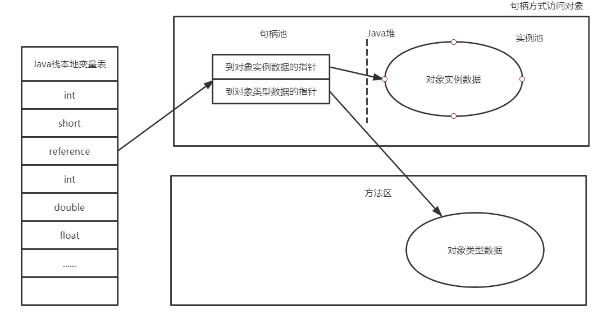
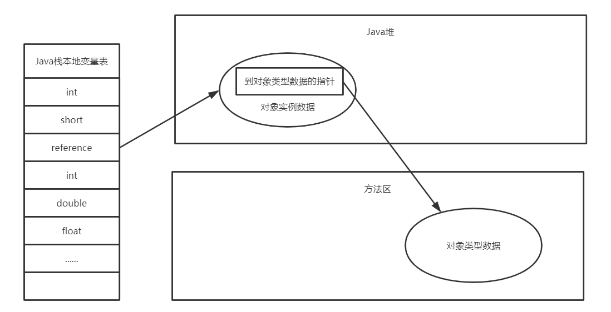

# 深入理解Java虚拟机（第三版）

## 第二部分 自动内存管理

### 第2章 Java内存区域与内存溢出异常

#### 运行时数据区域

> HotSpot虚拟机不区分虚拟机栈和本地方法栈

#### 新new对象的步骤

1. 开辟一块内存
   - 开辟内存的两种方法
     - 指针碰撞 - 适用于内存空间整齐
     - 空闲列表法 - 适用于内存空间杂乱无章
   - 并发开辟内存带来的问题
     - CAS法
     - 线程本地缓冲区(TLAB)：先在线程本地分配，然后合并到堆内存
2. 为内存赋零值
3. 为对象头赋值
4. 执行init方法，赋初始值
5. 栈指向堆

#### 对象的内存布局

1. 对象头
   - Mark Word
     - 用于存储对象自身的运行时数据：HashCode，GC分代年龄，锁的状态，偏向线程ID
   - 类型指针
     - 对象指向它的类型元数据的指针，Java虚拟机通过这个指针来确定该对象是哪个类的实例。
     - 并不是所有虚拟机的实现都存在类型指针
   - 数组长度
2. 实例数据
   - 对象真正存储的有效信息
3. 对齐补充
   - 占位符，HotSpot要求对象的大小必须是8字节的整数倍

#### 对象的访问方式

1. 句柄访问

- 好处：reference中存储的是稳定句柄的地址，在对象被移动时只会改变句柄中的实例指针，而reference本身并不需要被修改

2. 直接指针访问

- 好处：速度更快，节省了一次指针定位的时间开销

### 第3章 垃圾收集器与内存分配策略

#### 判断对象是否存活的算法

- 引用计数法：循环引用问题
- 可达性分析算法（根可达算法）

> 可作为GC Roots的对象：
>
> 1. 在虚拟机栈（栈帧中的本地变量表）中引用的对象
> 2. 在方法区中类静态属性引用的对象，譬如Java类的引用类型静态变量
> 3. 在方法区中常量引用的对象，譬如字符串常量池里的引用
> 4. 在本地方法栈中JNI（即通常所说的Native方法）引用的对象
> 5. Java虚拟机栈内部的引用，如基本数据类型对应的Class对象，一些常驻的异常对象，还有系统类加载器
> 6. 所有被同步锁（synchronized关键字）持有的对象
> 7. 反映Java虚拟机内部情况的JMXBean、JVMTI中注册的回调、本地代码缓存等

#### 强软弱虚四种引用

- 强引用

  `Object o = new Object()`，只要这种强引用关系还存在，垃圾收集器就永远不会回收掉被引用的对象

- 软引用

  一些还有用，但非必须的对象。在系统将要发生Out Of Memory时会回收

- 弱引用

  只要垃圾收集器开始工作，无论当前内存是否足够，都会回收掉。

- 虚引用

  最弱的一种引用关系，唯一目的是能在这个对象被收集器回收时受到一个系统通知

#### 对象的自我拯救

- 第一次标记

  对象在进行可行性分析后发现没有与GC Roots相连接的引用链，则会被第一次标记

- 第二次标记

  对象是否有必要执行finalize()：对象没有覆盖finalize()方法/finalize方法已经调用过，则“没有必要执行”

#### 垃圾收集算法

- 标记-清除算法
  - 执行效率不稳定
  - 内存空间的碎片化问题
- 标记-复制算法
  - 将可用内存缩小为原来的一半
- 标记-整理算法

#### 三色标记算法

> 白色：未扫描
>
> 灰色：被标记过，但有引用的对象没有被扫描
>
> 黑色：被标记，且所有引用对象都被扫描

> 出问题的点：灰色到白色的引用没了，新增一条黑色到白色的线
>
> 增量更新：赋值器插入了一条或多条从黑色对象到白色对象的新引用
>
> 原始快照：赋值器删除了全部从灰色对象到该白色对象的直接或间接引用