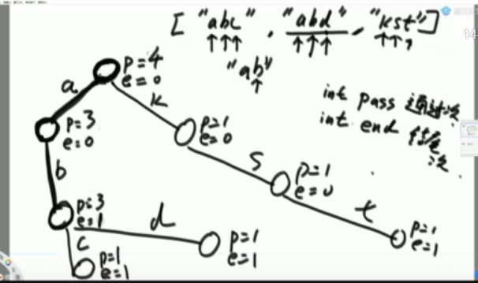
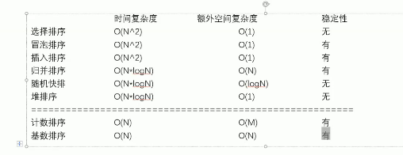

### 异或运算

- `0 ^ N == N`
- `N ^ N == 0`

#### Question 1  如何不用额外变量交换两个数？

```java
a = a ^ b;
b = a ^ b;
a = a ^ b;
```

#### Question 2 一个数组中有一种数出现了奇数次，其他数都出现了偶数次，怎么找到并打印这种数？

全部异或，最后剩下的就是这个数字

#### Question 3 怎么把一个int类型的数，提取出最右侧的1来

a & (~a + 1)

> 10010100101010000			a
>
> 01101011010101111			~a
>
> 01101011010110000			~a + 1
>
> 00000000000010000			a & (~a + 1)

#### Question 4 一个数组中有两种数出现了奇数次，其他数都出现了偶数次，怎么找到并打印这两种数 

1. 把数组中的所有数字全部异或，最终得到 a ^ b
2. 由于a和b肯定是不同的数字，那么得到的a ^ b至少有一个1
3. 利用Question 3 获取到最右侧的一个1，例如：最右侧的一个1在低7位
4. 将所有的数字分为2组，一组是低7位为0的，一组是低7位为1的，则a和b一定可以分为两组
5. 将第一组所有数字做异或，得到a和b中的一个，假设为a
6. 将a和第一步得到的a ^ b做异或，得到b

### 堆排序

#### TODO：从上往下建堆，从下往上建堆

### 前缀树

```
int pass;			// 通过次数
int end;			// 结尾次数
```



- 生成前缀树的时间复杂度：O(N)
- 前缀树的作用：
  - 查看字符串"abd"的个数：找a->b->d这条路，查找e值，则为abd的加入次数
  - 查看以"ab"为前缀的字符串的个数：找a->这条路，查找p值，则为ab前缀的次数
- 前缀树的优势：
  - 字符串有多长，就会遍历多少遍
- **<font color = "red">代码</font>**：前缀树的实现  insert search prefixNumber delete
  - `Node[]`
  - `HashMap<Integer, Node>`

### 不基于比较的排序(桶排序)

#### 计数排序

- 将员工的年龄排序：准备一个长度为200的数组，eg: arr[18]代表18岁的人有多少个，将age遍历一遍，放入数组，最后遍历数组，将i输出arr[i] 次
- 时间复杂度为O(N)
- 只有数据范围比较窄的时候才试用
- 是桶排序的一种，桶排序对数据状态都有一定的要求

#### 基数排序radixSort

- 非负，且10进制数字的排序
- 算法思想
  1. 遍历一遍，找到最大值，得到其位数，将所有其他数字，不足位数的前面补0
  2. 准备10个桶，即10个队列
  3. 从前往后遍历，根据个位数分别进入对应的桶
  4. 从左边的桶开始倒数字，先进先出
  5. 从前往后遍历，根据十位数进桶，然后倒出

> 基于比较的排序，极限就是O(NlogN)

- <font color="red">**代码实现基数排序**</font>

```
arr = [101, 003, 202, 41, 302];
count = [0, 2, 2, 1, 0, 0, 0, 0, 0, 0]		// 计数排序
		[0, 1, 2, 3, 4, 5, 6, 7, 8, 9]
count'= [0, 2, 4, 5, 5, 5, 5, 5, 5, 5]		// 个位数<=i的有几个
		[0, 1, 2, 3, 4, 5, 6, 7, 8, 9]
help[] 与 arr等长
从右往左遍历，遇到302, 个位数<=2的有4个，放到help[3]里，count'[2]--，以此类推
help = [101,41,202,302,003]

// 然后十位、百位...
```

实际上的时间复杂度O(N*log10 N)，大致上为O(N)

### 排序算法总结

