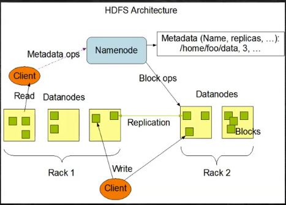

# 大数据启蒙

- 分而治之
- 并行计算
- 计算向数据移动
- 数据本地读取

# Hadoop - HDFS

## 存储模型

- 文件线性按字节切割成块(block)，具有offset(偏移量)，id

- 不同之间文件的block大小可以不一样

- 一个文件除最后一个block，其他block大小一致

  > unicode一个汉字2个字节，utf-8一个汉字3个字节存储，切割为block可能会切在不同的块里

- block的大小依据硬件的I/O特性调整

- block被分散存在集群的节点中，具有location

- block具有副本(replication)，没有主从概念，副本不能出现在同一个节点

  > 说某个block具有n个副本，则一共有n个此块，不存在主从

- 副本是满足可靠性和性能的关键

- 文件上传可以指定block大小和副本数，上传后只能修改副本数

- 一次写入多次读取，不支持修改

  > 如果支持修改，系统对文件块写入新数据，文件块放回的时候大小会改变，下一个文件快的偏移量会出错，必须要后面的所有文件块都做修改才能保证信息的正确性，操作消耗过多性能，泛洪操作

- 支持追加数据

  > 不会造成泛洪操作，只需要在最后追加文件块即可

## HDFS的架构设计

- HDFS是一个主从（master/slaves）架构

  > 主从：主从二人都是工作的，之间有通信有协作
  >
  > 主备：备用不处理业务，主挂了之后才会切换到备用机

- 由一个NameNode和一个DataNode组成

- 面向文件包括：文件数据(data)和文件元数据(metadata)

  > metadata：文件的描述信息，如文件名、大小、位置等

- NameNode负责存储和管理文件元数据，并维护了一个层次型的文件目录树
- DataNode负责存储文件数据（block块），并提供block的读写
- DataNode与NameNode维持心跳，并汇报自己持有的block信息
- Client和NameNode交互文件元数据，和DataNode交互文件block数据

### 角色功能

#### NameNode

- 完全基于内存存储文件元数据、目录结构、文件block的映射
- 需要持久化方案保证数据的可靠性
- 提供副本放置策略

#### DataNode

- 基于本地磁盘存储block（文件的形式）
- 并保存block的校验和数据保证block的可靠性
- 与NameNode保持心跳，汇报block列表状态